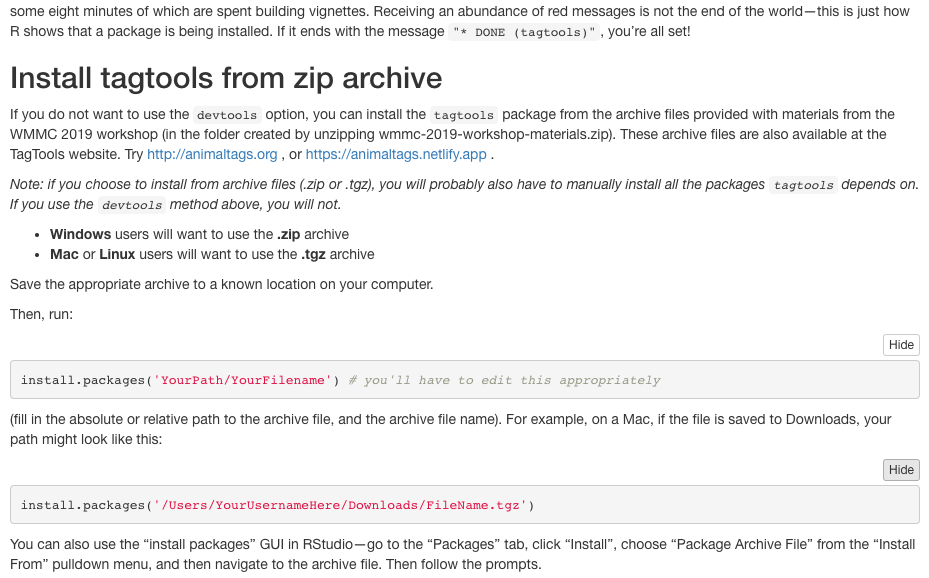
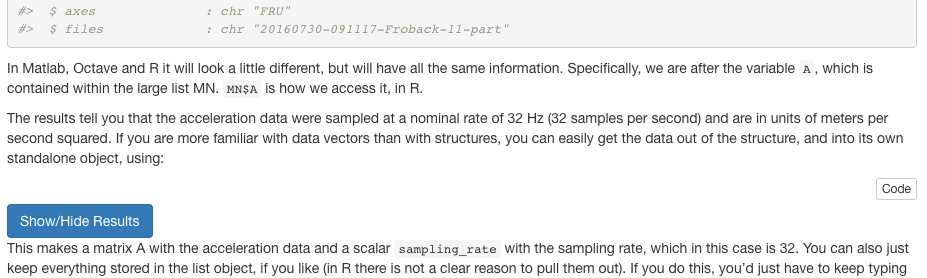

```{r setup, include = FALSE}
knitr::opts_chunk$set(
  collapse = TRUE,
  comment = "#>"
)
require(tagtools)
```

Welcome to TagTools! On behalf of the team who developed this website and these software tools, thanks for checking out our project---we hope you're doing well. 

These webpages are called *vignettes*, which means they can run in R directly. Each page is designed to teach you how to use a few functions together to accomplish usually a single task, or a short set of interrelated tasks. All of them might be helpful to you as you learn and work in biologging. 

In this page, you will be quickly introduced to each of the vignettes included in the package, so that you might be able to get a sense for which would be helpful to you today. They are presented in a suggested order. More help is generally provided in the vignettes earlier in sequence, and more independence is generally required in some of the later ones. 

*Estimated time to read this vignette: 20 minutes.*

# More background: What's in a Vignette?

Already familiar with the concept? Feel free to skip down to [Introductory vignettes]! 

A vignette contains various chunks of information one after the other, including plain text chunks (like this one), code chunks, and---especially in this package---collapsible answers and results sections. These are really plain text chunks and code chunks running directly with some HTML code to make them easily hidden by default, then openable with a click of a button.

Here is an example of a code chunk. Click "Code" below right to expand it.

```{r, echo = TRUE, eval = FALSE}
# This is a code chunk!
print("Hello, Biologger!")
print(sqrt(256))
yData <- sin(c(1:24)*pi/12)
plot(x = c(1:length(yData)), y = yData, xlab = "X", ylab = "sin(π/12 X)")
```

In this package, we often include the results of a given code chunk directly after the code chunk, especially if there is some interesting visible result. The code above is an example of that, so let's see some results.

<button class="btn btn-primary" data-toggle="collapse" data-target="#results_the_first"> Show/Hide Results </button>  
<div id="results_the_first" class="collapse"> 
```{r, echo = FALSE, eval = TRUE}
# This is a code chunk!
print("Hello, Biologger!")
print(sqrt(256))
yData <- sin(c(1:24)*pi/12)
plot(x = c(1:length(yData)), y = yData, xlab = "X", ylab = "sin(π/12 X)")
```
</div>

All code provided in vignettes that are presented this way should run smoothly. The code has been checked quite a few times for bugs, including every time that the package is built using the following command:

```{r, echo = TRUE, eval = FALSE}
devtools::install_github('stacyderuiter/TagTools/R/tagtools', build_vignettes = TRUE)
```

# Introductory vignettes
If you're new to the package, these vignettes are for you! Anyone could benefit from reviewing some of the basics of making sure the package is loaded correctly, loading data, converting between (sensor) data structures and vectors, and using our plotter function, `plott`. 

## *0. Overview (this vignette!)*

## 1. install-load-tagtools

`vignette('install-load-tagtools')`

*Estimated time to complete: 15 minutes.*

This vignette is especially helpful for the very new users who haven't yet installed tagtools. A couple of different options for installation are given, with some helpful information as to how to interpret the messages R sends as you are installing. For example, did you know that getting a lot of red messages in a row isn't always a bad thing (in fact, during package install, it can mean everything is running smoothly)?

```{r, echo = FALSE}

```


## 2. load-tag-data 

`vignette('load-tag-data')`

*Estimated time to complete: 20 minutes.* 

This vignette deals with the functions `load_nc`, `add_nc`, and `save_nc`, which form the backbone of dealing with data from NetCDF files. In particular, you'll use `load_nc` in every vignette after this one. By doing this vignette, you will learn a couple of different ways to load in data, which is particularly important if you're finding your data somewhere other than the tagtools package (with its eight built-in datasets). You'll also learn to add and edit metadata---important data about the data. 

```{r, echo = FALSE}
knitr::include_graphics('MN_in_environment.png')
```


## 3. vectors-vs-structures

`vignette('vectors-vs-structures')`

*Estimated time to complete: 15 minutes.*

This quick vignette talks about the differences between vectors (scalars, matrices---all standalone objects) and data structures (which contain more than one object). Particularly important to understand is the `$` operator, used extensively in R with our datasets. For instance, the acceleration data of a dataset called `bw`, for `beaked_whale`, might be found under `bw$A`. 

```{r, echo = FALSE}

```


## 4. plots-and-cropping

`vignette('plots-and-cropping')`

*Estimated time to complete: 25 minutes.*

This is the first vignette for which we can include a really compelling graphic to lure you to try it! You'll learn to use the tagtools plotter function `plott`, and crop some irrelevant data (at the beginning and end of a recording) out, allowing you to plot just the data that was actually from an animal. 

```{r, echo = FALSE, eval = TRUE}
library(tagtools)
cats_file_path <- system.file("extdata", "cats_test_raw.nc", package = "tagtools", mustWork = TRUE)
MN <- load_nc(cats_file_path)
plott(X = list(Depth = MN$Depth, Acceleration = MN$Acc, Gyroscope = MN$Gyr), interactive = FALSE)
```


# Calibration

## 1. data-quality-error-correction

`vignette('data-quality-error-correction')`

*Estimated time to complete: 25 minutes.*

You'll find some common sources of error in accelerometer and magnetometer data, and see some ways that these errors can be corrected. Quality checking is fairly easy for pressure (depth) data from aquatic mammals because we know they will breathe at the surface. Data from accelerometers and magnetometers are more difficult. For one thing, there are three axes, and also we don’t have such an intuitive feel for what they should look like. However, fortunately, there are some quality checks we can do with `A` and `M` data that help to catch and correct problems.

```{r, echo = FALSE, eval = TRUE}
sw_file_path <- system.file("extdata", "rawtestset3.nc", package = "tagtools", mustWork = TRUE)
sw <- load_nc(sw_file_path)
AMcheck <- check_AM(sw$A, sw$M)
sampling_rate <- sw$A$sampling_rate # get the sampling rate for plotting
plott(X = list(`Field strength (micro-teslas)` = AMcheck$fstr, `Inclination angle (degrees)` = AMcheck$incl*180/pi), fsx = sampling_rate)
```


## 2. tag-to-whale-frame

`vignette('tag-to-whale-frame')`

*Estimated time to complete: 25 minutes.*

You'll correct data that was not oriented properly into the animal's frame of reference. For tags placed on free-swimming animals, the tag axes will not generally coincide with the animal's axes. The tag `A` and `M` data will therefore tell you how the tag, not the animal, is oriented. This can be corrected if you know the orientation of the tag on the animal (the pitch, roll and heading of the tag when the animal is horizontal and pointing north). Three steps are needed to do this: First the tag orientation on the whale is inferred by looking at accelerometer values when the animal is near the surface. The orientation may change if the tag moves or slides during a deployment and so we make an 'orientation table' that describes the sequence of orientations of the tag. This table is then used to convert tag frame measurements into animal frame.  

```{r, echo = FALSE, eval = TRUE}
sw_file_path <- system.file("extdata", "testset5.nc", package = "tagtools", mustWork = TRUE)
sw <- load_nc(sw_file_path)
# something cool once PRH_predictor works :(
```


# Filtering

These three vignettes are particularly interrelated, so we do recommend doing them together. Each has to do with applying some sort of a filter (e.g. high-pass filtering, low-pass filtering) to gain more insight from data (e.g. acceleration or magnetometer).

## 1. acceleration-filtering

`vignette('acceleration-filtering')`

*Estimated time to complete: 20 minutes.*

You'll use complementary filters on acceleration data taken from a beaked whale. This will separate intervals of movements into distinct frequency bands, i.e., posture (low frequency) and strikes/flinches (high frequency), in order to gain insight about the movements of the animal. 

```{r, echo = FALSE, eval = TRUE}
bw_file_path <- system.file("extdata", "testset1.nc", package = "tagtools", mustWork = TRUE)
bw <- load_nc(bw_file_path)
fc <- 0.3814753*.7
Af <- comp_filt(bw$A, fc = fc) 
Alow <- Af[[1]]     # low frequency A data
Ahigh <- Af[[2]]      # high frequency A data
sampling_rate <- bw$A$sampling_rate
plott(X = list(`Depth (m)` = bw$P$data,
               `LF Accel` = Alow, 
               `HF Accel` = Ahigh),
      fsx = sampling_rate, r = c(TRUE, FALSE, FALSE))
```


## 2. jerk-transients

`vignette('jerk-transients')`

*Estimated time to complete: 20 minutes.*

We work with acceleration data all the time, and you know acceleration is the second derivative of position. Take a third derivative and you'll have what is called the jerk, which can be used effectively as a high-pass filter. This will also illuminate the particular value of having high-resolution data (especially data with a lot of high-frequency content). 

```{r, echo = FALSE, eval = TRUE}
bw_file_path <- system.file("extdata", "testset1.nc", package = 'tagtools', mustWork = TRUE)
bw <- load_nc(bw_file_path)
J <- njerk(bw$A)
fs <- bw$A$sampling_rate
Ad <- decdc(bw$A, 5)
Jd <- njerk(Ad)
plott(X = list(Depth = bw$P$data, `25 Hz Jerk` = J, `5Hz Jerk` = Jd),
      fsx = c(fs, fs, fs/5), r=c(TRUE, FALSE, FALSE))
```


## 3. magnetometer-filtering

`vignette('magnetometer-filtering')`

*Estimated time to complete: 20 minutes.*

You'll use the same techniques from `acceleration-filtering`, but on magnetometer data.

```{r, echo = FALSE, eval = TRUE}
intvl1 <- c(36*60, 38*60) 
intvl2 <- c(56*60, 58*60)
Mf <- comp_filt(bw$M, fc = fc) 
Mhigh <- Mf[[2]]	# high frequency M data
Mh1 <- crop_to(Mhigh, sampling_rate = sampling_rate, tcues = intvl1)
Mh2 = crop_to(Mhigh, sampling_rate = sampling_rate, tcues = intvl2)
plott(X = list(`Mh Interval 1` = Mh1, `Mh interval 2` = Mh2), fsx = sampling_rate)
```


# Advanced processing

These vignettes are a bit of a hodge-podge: all things that you can do now once you have some experience working with the `tagtools` package. Slightly less guidance is given, and slightly more independence is expected/required. 

## 1. fine-scale-tracking

`vignette('fine-scale-tracking')`

*Estimated time to complete: 40 minutes.*

This is a longer vignette---not shortened from the older practical. You will dead-reckon the travel path of an animal based on estimates of forward speed... and without any knowledge of currents (thus, an estimate of where the animal might have traveled relative to an object "dead in the water"). Large errors result. But with the help of some correction, a more full picture of animal movement can emerge, as compared to what we could have gathered simply using GPS data.  

```{r, echo = FALSE, eval = TRUE}
d7_file_path <- system.file("extdata", "testset7.nc", package = "tagtools", mustWork = TRUE)
d7 <- load_nc(d7_file_path)
sampling_rate <- d7$P$sampling_rate
POSLLF <- lalo2llf(trk = d7$POS$data[,c(2:3)])
spd <- 1.7
DR <- ptrack(A = d7$Aa, M = d7$Ma, s = spd)
plot(DR$easting, DR$northing, type = 'l',
     xlab = 'Easting, m', ylab = 'Northing, m',
     main = 'Dead-Reckoned Track',
     yl = c(-1000, 5000))
lines(POSLLF$easting, POSLLF$northing, type = 'b', col = 'red', pch = 20)
pitch_roll <- a2pr(d7$Aa)
FT <- fit_tracks(P = POSLLF, T = d7$POS$data[,1],
                D = DR[,c(1:2)],
                sampling_rate = d7$Aa$sampling_rate)
roll_deg <- pitch_roll$r/pi*180
col_line3(x = FT$easting, y = FT$northing, 
          z = d7$P$data, c = roll_deg)
```


## 2. find-dives

`vignette('find-dives')`

*Estimated time to complete: 20 mins*

This vignette starts with a quick review, where you'll find and correct for a few different sources of error in some depth data. Then, you'll locate the beginnings and endings of dives, and plot these beginnings and endings on a depth profile using the function `find_dives`. You'll also do some simple analysis, like calculating the mean dive depth.

```{r, echo = FALSE, eval = TRUE}
MN_file_path <- system.file("extdata", "mn12_186a_raw.nc", package = "tagtools", mustWork = TRUE)
MN <- load_nc(MN_file_path)
Pc = crop_to(X = MN$P, sampling_rate = 1, tcues = c(0, 25306), T = NULL)
Pcm = median_filter(Pc,n=3)
Tc <- crop_to(MN$T,tcues=Pc$crop)
Pcmf <- fix_pressure(Pcm, Tc)
d <- find_dives(Pcmf$p,mindepth=5)
plott(X=list(Pcmf=Pcmf$p), r=TRUE)
points(d$start/(3600*24),rep(0,nrow(d)),col='green', pch=19)
points(d$end/(3600*24),rep(0,nrow(d)),col='red', pch=17)
```


## 3. dive-stats

`vignette('dive-stats')`

*Estimated time to complete: 25 mins*

This vignette also has a nice review of some previous concepts---cropping data, calibrating data, and then finding dives. After that, you'll use the function `dive_stats` to efficiently compute summary statistics on dives from a depth profile. 

```{r, echo = FALSE, eval = TRUE}
ZC_file_path <- system.file("extdata", "zc11_267a.nc", package = "tagtools", mustWork = TRUE)
ZC <- load_nc(ZC_file_path)
ZPCr = crop_to(ZC$P, sampling_rate = ZC$P$sampling_rate, tcues = c(9424, 64027), T = NULL)
mindepth <- 50 
dt <- find_dives(ZPCr, mindepth=mindepth) 
ds <- dive_stats(ZPCr, dive_cues=dt[,c('start', 'end'),]) 
head(ds)
```


## 4. rotation-test

`vignette('rotation-test')`

*Estimated time to complete: 20 mins*

You'll use a statistical method to test whether a hypothesis holds up under scrutiny, using a dataset from(?) a beloved lake creature. It's nice to do this one after `find-dives`, since you'll use similar techniques from this one. 

```{r, echo = FALSE, eval = TRUE}
nessie_file_path <- system.file("extdata", "nessie.nc", package = "tagtools", mustWork = TRUE)
nessie <- load_nc(nessie_file_path)
th <- 0.6
# find dives
dt <- find_dives(nessie$P, mindepth = th)
t <- as.POSIXct(nessie$info$dephist_device_datetime_start, tz = 'GMT') + c(1:nrow(nessie$P$data))/nessie$P$sampling_rate
# find data times between 11:30 and 12:30
s <- as.POSIXct('2017-01-13 11:30:00', tz = 'GMT')
e <- as.POSIXct('2017-01-13 12:30:00', tz = 'GMT')
noon <- range(which(t < e & t > s)) 
#convert to seconds
noon <- noon/nessie$P$sampling_rate
#do test
RTR <- rotation_test(event_times = dt$start, exp_period = noon, full_period = c(0,length(nessie$P$data)/nessie$P$sampling_rate), n_rot = 10000, ts_fun = length)
print(RTR)
```


## 5. mahalanobis-distance

`vignette('mahalanobis-distance')`

*Estimated time to complete: 25 mins*

You'll compare data to other data to see how out of the ordinary it is, using a dataset from a whale that underwent controlled exposure to military sonar. 

```{r, echo = FALSE, eval = TRUE}
ZC_file_path <- system.file("extdata", "zc11_267a.nc", package = "tagtools", mustWork = TRUE)
zc <- load_nc(ZC_file_path)
plott(X = list(Depth = zc$P$data, Accel = zc$A$data), fsx = zc$P$sampling_rate, interactive = FALSE)
```


# Miscellaneous

The `Detectors` (and `detectors-draft`) vignette deal with the function `detect_peaks`. They lack some of the newer features in the other vignettes (hideable results, answers), but are worth trying nevertheless. 

# Conclusion

Thanks for reading---best of luck! 

***

Animaltags home pages: http://animaltags.org/ (old), https://animaltags.netlify.app/ (new), https://github.com/stacyderuiter/TagTools (for latest beta source code), https://stacyderuiter.github.io/TagTools/articles/TagTools (vignettes overview)