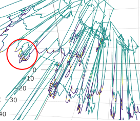

```{r setup, include = FALSE}
knitr::opts_chunk$set(
  collapse = TRUE,
  comment = "#>"
)
require(tagtools)
```

Welcome to the `fine-scale-tracking` vignette! Thanks for taking some time to get to know our package; we hope it sparks joy. 

This practical covers how to compute a dead-reckoned track from accelerometer and magnetemeter data and compares this track estimate to GPS positions that were taken by the tag. This illustrates both the high resolution of dead-reckoned tracks and the **very** large errors that can accumulate. You will then explore how to merge the GPS and dead-reckoned tracks to produce a high-resolution track with lower error and try visualizing the track coloured by another parameter.

*Estimated time for this vignette: 40 minutes.*

These practicals all assume that you have R/Rstudio installed on your machine, some basic experience working with them, and can execute provided code, making some user-specific changes along the way (e.g. to help R find a file you downloaded). We will provide you with quite a few lines. To boost your own learning, you would do well to try and write them before opening what we give, using this just to check your work.

Additionally, be careful when copy-pasting special characters such as \_underscores\_ and 'quotes'. If you get an error, one thing to check is that you have just single, simple underscores, and `'straight quotes'`, whether `'single'` or `"double"` (rather than “smart quotes”). 

# Load and Explore Data
Load the data set `testset7.nc`. This dataset is built into the `tagtools` package, so you can access it using `system.file`. 

Then, check the contents of the data structures to answer the following questions. (See the code below if and only if you need a hint.)

- What species did the data come from, and where did the data come from?
<button class="btn btn-primary" data-toggle="collapse" data-target="#ans_quickie1"> _Show/Hide Answers_ </button>  
<div id="ans_quickie1" class="collapse">
*A humpback whale, *Megaptera novaeangliae*.*
</div>

- What is the sampling rate of the accelerometer data?
<button class="btn btn-primary" data-toggle="collapse" data-target="#ans_quickie2"> _Show/Hide Answers_ </button>  
<div id="ans_quickie2" class="collapse">
*1 Hz.*
</div>

- What processing steps have already been applied to the magnetometer data?
<button class="btn btn-primary" data-toggle="collapse" data-target="#ans_quickie3"> _Show/Hide Answers_ </button>  
<div id="ans_quickie3" class="collapse">
*sens_struct, do_cal, tag2animal, crop_to, decdc(5)... So, it has been converted to a sensor structure, calibrated, put into the animal frame, cropped to a certain segment of data, and decimated by a factor of five (as a result, the sampling rate is now the same as the acceleration data, 1 Hz).*
</div>

- What is in the 3 columns in the POS (GPS position) data?
<button class="btn btn-primary" data-toggle="collapse" data-target="#ans_quickie4"> _Show/Hide Answers_ </button>  
<div id="ans_quickie4" class="collapse">
*The three columns are the time, the latitude, and the longitude.*
</div>

- Which frame is the accelerometer data in? Which frame is the magnetometer data in? 
<button class="btn btn-primary" data-toggle="collapse" data-target="#ans_quickie5"> _Show/Hide Answers_ </button>  
<div id="ans_quickie5" class="collapse">
*The accelerometer data is oriented in the animal frame, and so is the magnetometer data.*
</div>

```{r, eval = TRUE, echo = TRUE}
str(d7$info, max.level = 1)
str(d7$Aa, max.level = 1)
str(d7$POS, max.level = 1)
```

Plot the pressure and accelerometer data with `plott()` to get a sense for what the animal might be doing in this data segment. Note that the code example below assumes you have called the data set `d7`:

```{r, eval = FALSE, echo = TRUE}
library(tagtools)
d7_file_path <- system.file("extdata", "testset7.nc", package = "tagtools", mustWork = TRUE)
d7 <- load_nc(d7_file_path)
sampling_rate <- d7$P$sampling_rate
plott(X = list(Depth = d7$P, Acceleration = d7$Aa), fsx = sampling_rate, interactive = TRUE)
```

<button class="btn btn-primary" data-toggle="collapse" data-target="#plott_d7"> Show/Hide Results </button>  
<div id="plott_d7" class="collapse"> 

```{r, eval = TRUE, echo = FALSE}
d7_file_path <- system.file("extdata", "testset7.nc", package = "tagtools", mustWork = TRUE)
d7 <- load_nc(d7_file_path)
sampling_rate <- d7$P$sampling_rate
plott(X = list(Depth = d7$P, Acceleration = d7$Aa), fsx = sampling_rate, interactive = FALSE)
```

</div>

Then, plot the GPS positions:

```{r, echo = TRUE, eval = FALSE}
plot(d7$POS$data[,3], d7$POS$data[,2], type = 'b', pch = 20)
```

<button class="btn btn-primary" data-toggle="collapse" data-target="#plott_d7_POS"> Show/Hide Results </button>  
<div id="plott_d7_POS" class="collapse"> 

```{r, echo = FALSE, eval = TRUE}
plot(d7$POS$data[,3], d7$POS$data[,2], type = 'b', pch = 20)
```

</div>

# Dead-reckoning

## What is Dead-reckoning?
Hearken back to your earliest trigonometry course. Chances are, you used angles and distances to calculate other distances (on a right triangle, especially). Then, in calculus, you've probably used angles and rates of change to calculate distance or other rates of change. Dead-reckoning is essentially this---using just a heading and a forward speed in order to plot a forward path. The technique is fairly commonplace in sailing and aviation, and can be made accurate with the help of known position data. If you want more background, consult [this video](https://www.youtube.com/watch?v=doZ1k1Oeeh8) for an example with some simple trigonometry. 

However, per [Wikipedia](https://en.wikipedia.org/wiki/Dead_reckoning#Errors) (which simply says it very well), dead-reckoning "is subject to significant errors of approximation. For precise positional information, both speed and direction must be accurately known at all times during travel. Most notably, dead reckoning does not account for directional drift during travel through a fluid medium. These errors tend to compound themselves over greater distances". We will see how this is true over the course of this vignette---water is seldom entirely still, and there is quite a current present in the data we will soon investigate. 

## Why use Dead-reckoning?
The plot shows a mix of intensive and extensive movements, but the constraint of only getting positions when the animal is at the surface means we cannot infer much about the movement behaviour within dives. Dead-reckoning from accelerometer and magnetometer data is the only way to estimate movement within dives without requiring external tracking infrastructure. 

## Estimating Animal Speed
Dead-reckoning uses the accelerometer and magnetometer to calculate the direction of travel. In what frame do these data need to be? 

<button class="btn btn-primary" data-toggle="collapse" data-target="#ans_frame_to_calc"> _Show/Hide Answers_ </button>  
<div id="ans_frame_to_calc" class="collapse">
*They both need to be in the animal frame. Thankfully, they both already are!*
</div>

An estimate of the forward speed is also required. We don't have a speed sensor---doing this would actually be quite cumbersome, as compared to an acceleration sensor. Nevertheless, we can compute the vertical speed (i.e., the differential of the depth) during descents and ascents, which might be a good starting guess:

```{r, echo = TRUE, eval = FALSE}
v <- depth_rate(d7$P)
plott(X = list(Depth = d7$P$data, `Vertical Speed` = v), 
      fsx = sampling_rate)
```

<button class="btn btn-primary" data-toggle="collapse" data-target="#plott_v"> Show/Hide Results </button>  
<div id="plott_v" class="collapse"> 

```{r, echo = FALSE, eval = TRUE}
v <- depth_rate(d7$P)
plott(X = list(Depth = d7$P$data, `Vertical Speed` = v), 
      fsx = sampling_rate)
```

</div>

Set `interactive = TRUE` and zoom in to individual dives on this plot to get a rough idea of the descent and ascent speed of the whale. 

Or, if the interactive figure drives you a bit crazy, just set the axis limits:

```{r, echo = TRUE, eval = FALSE}
plott(X = list(Depth = d7$P$data, `Vertical Speed` = v), 
       fsx = sampling_rate, xl = c(0,0.1))
```

<button class="btn btn-primary" data-toggle="collapse" data-target="#plott_v2"> Show/Hide Results </button>  
<div id="plott_v2" class="collapse"> 

```{r, echo = FALSE, eval = TRUE}
plott(X = list(Depth = d7$P$data, `Vertical Speed` = v), 
       fsx = sampling_rate, xl = c(0,0.1))
```

</div>

## Computing a Dead-Reckoned Track
Call your speed estimate speed `spd` and use it in the following line to compute the dead-reckoned track:

```{r, echo = TRUE, eval = FALSE}
spd <- #???? (fill in your estimate here)
DR <- ptrack(A = d7$Aa, M = d7$Ma, s = spd)
plot(DR$easting, DR$northing, type = 'l',
     xlab = 'Easting, m', ylab = 'Northing, m',
     main = 'Dead-Reckoned Track')
```

<button class="btn btn-primary" data-toggle="collapse" data-target="#plott_deadreckon1"> Show/Hide Results </button>  
<div id="plott_deadreckon1" class="collapse"> 

```{r, echo = FALSE, eval = TRUE}
spd <- 1.7
DR <- ptrack(A = d7$Aa, M = d7$Ma, s = spd)
plot(DR$easting, DR$northing, type = 'l',
     xlab = 'Easting, m', ylab = 'Northing, m',
     main = 'Dead-Reckoned Track')
```

</div>

A dead-reckoned track is a series of distances north (or south if negative) and east (or west if negative) of the starting point which is position (0, 0) in the plot. The first two columns of DR are these 'northing' and 'easting' values. The DR track is defined in a Local Level Frame (LLF) as opposed to latitude and longitude. An LLF is like a map---a region that is small enough that we can assume the earth is flat---centered on the starting point. 

**How does the spatial resolution of the dead-reckoned track look compared to the surface GPS positions?**

<button class="btn btn-primary" data-toggle="collapse" data-target="#ans_spatial_rez"> _Show/Hide Answers_ </button>  
<div id="ans_spatial_rez" class="collapse">
*At first glance, the shape is quite similar, so this might not concern us yet. Also, the spatial resolution looks much, much better! So, making this track seems like a good idea.*
</div>

## Adding GPS positions
To plot the GPS positions on the same plot, we need to first convert them into the same LLF. The first GPS position is only 0.8s into the dataset (this is `\$d7\$POS\$data[1,1]`) so we can say that the dead-reckoned track starts from this point. To convert latitude and longitude into the LLF use:

```{r, echo = TRUE, eval = FALSE}
POSLLF <- lalo2llf(trk = d7$POS$data[,c(2:3)])
plot(DR$easting, DR$northing, type = 'l',
     xlab = 'Easting, m', ylab = 'Northing, m',
     main = 'Dead-Reckoned Track',
     yl = c(-1000, 5000))
lines(POSLLF$easting, POSLLF$northing, type = 'b', col = 'red', pch = 20)
```

<button class="btn btn-primary" data-toggle="collapse" data-target="#plott_posllf"> Show/Hide Results </button>  
<div id="plott_posllf" class="collapse"> 

```{r, echo = FALSE, eval = TRUE}
POSLLF <- lalo2llf(trk = d7$POS$data[,c(2:3)])
plot(DR$easting, DR$northing, type = 'l',
     xlab = 'Easting, m', ylab = 'Northing, m',
     main = 'Dead-Reckoned Track',
     yl = c(-1000, 5000))
lines(POSLLF$easting, POSLLF$northing, type = 'b', col = 'red', pch = 20)
```

</div>

How well does the dead-reckoned track match up to the GPS positions? 

<button class="btn btn-primary" data-toggle="collapse" data-target="#ans_NOTMATCHINGATALL"> _Show/Hide Answers_ </button>  
<div id="ans_NOTMATCHINGATALL" class="collapse">
*They do not match up much at all. They touch at the beginning... and that's about it. After that, the shapes are somewhat preserved, but the predicted track is way farther north, and quite a ways farther east, than the actual known positions.*
</div>

The dead-reckoned track is always computed with respect to the water, not the ground, but we are plotting it here with respect to the ground. A more accurate track would take into account the water current. Can you imagine what current direction would be needed to make the dead-reckoned track more closely match the GPS positions?

<button class="btn btn-primary" data-toggle="collapse" data-target="#ans_SOUTHCURRENT"> _Show/Hide Answers_ </button>  
<div id="ans_SOUTHCURRENT" class="collapse">
*The current would need to be moving quite a bit south, and also some distance west, in order to compensate for the large errors we are seeing.*
</div>

There are a number of ways to combine the GPS positions and the dead-reckoned track into a single track which has both the absolute accuracy of GPS and the high temporal resolution of dead-reckoning. A simple method is to force the dead-reckoned track to meet the GPS positions at each surfacing by adding a constant 'current' to each track point in the preceding dive. This is done by `fit_tracks`:

```{r, eval = FALSE, echo = TRUE}
FT <- fit_tracks(P = POSLLF, T = d7$POS$data[,1],
                D = DR[,c(1:2)],
                sampling_rate = d7$Aa$sampling_rate)
# add to plot
plot(DR$easting, DR$northing, type = 'l',
     xlab = 'Easting, m', ylab = 'Northing, m',
     main = 'Dead-Reckoned Track',
     yl = c(-1000, 5000))
lines(POSLLF$easting, POSLLF$northing, type = 'b', col = 'red', pch = 20)

lines(FT$easting, FT$northing, col = 'darkgreen')		
```

<button class="btn btn-primary" data-toggle="collapse" data-target="#fit_tracks"> Show/Hide Results </button>  
<div id="fit_tracks" class="collapse"> 

```{r, eval = TRUE, echo = FALSE}
FT <- fit_tracks(P = POSLLF, T = d7$POS$data[,1],
                D = DR[,c(1:2)],
                sampling_rate = d7$Aa$sampling_rate)
# add to plot
plot(DR$easting, DR$northing, type = 'l',
     xlab = 'Easting, m', ylab = 'Northing, m',
     main = 'Dead-Reckoned Track',
     yl = c(-1000, 5000))
lines(POSLLF$easting, POSLLF$northing, type = 'b', col = 'red', pch = 20)

lines(FT$easting, FT$northing, col = 'darkgreen')		
```

</div>

## A digression about graphics

**Skip to the next section if you're not interested in improving the plots.**

If you are interested in a nicer, zoomable plot and either have, or are willing to install, packages `ggformula` and `plotly`, give the following a try!

```{r, echo = TRUE, eval = FALSE}
# if you need to install:
# install.packages(pkgs = c('ggformula', 'plotly'))
library(ggformula)
library(plotly)
theme_set(theme_bw(base_size = 12))

track_fig <- gf_path(northing ~ easting, data = DR,
         xlab = 'Easting, m', ylab = 'Northing, m') %>%
  gf_path(northing ~ easting, data = POSLLF, color = 'darkred') %>%
  gf_point(northing ~ easting, data = POSLLF, color = 'darkred') %>%
  gf_path(northing ~ easting, data = FT, color = 'darkgreen')

track_fig
```

<button class="btn btn-primary" data-toggle="collapse" data-target="#track_fig"> Show/Hide Results </button>  
<div id="track_fig" class="collapse"> 

```{r, eval = TRUE, echo = FALSE}
library(ggformula)
library(plotly)
theme_set(theme_bw(base_size = 12))

track_fig <- gf_path(northing ~ easting, data = DR,
         xlab = 'Easting, m', ylab = 'Northing, m') %>%
  gf_path(northing ~ easting, data = POSLLF, color = 'darkred') %>%
  gf_point(northing ~ easting, data = POSLLF, color = 'darkred') %>%
  gf_path(northing ~ easting, data = FT, color = 'darkgreen')

track_fig
```

</div>

OK, that's the track figure. What about zooming and interaction?

```{r, echo = TRUE, eval = FALSE}
track_fig %>% ggplotly()
```

<button class="btn btn-primary" data-toggle="collapse" data-target="#track_fig_ggplotly"> Show/Hide Results </button>  
<div id="track_fig_ggplotly" class="collapse"> 

```{r, echo = FALSE, eval = TRUE}
track_fig %>% ggplotly()
```

</div>

Ahhh, so much nicer! But do note that `plotly()` figures render only in interactive R sessions or, if using Rmarkdown, in html output (not PDF).

This figure is also nicer in that we can update it by chaining. For example, to change the axis limits:

```{r, echo = TRUE, eval = FALSE}
track_fig_zoom <- track_fig %>%
  gf_lims(x = c(-500, 1500), y = c(-1100, 100))
track_fig_zoom
```

<button class="btn btn-primary" data-toggle="collapse" data-target="#track_fig_zoom"> Show/Hide Results </button>  
<div id="track_fig_zoom" class="collapse"> 

```{r, echo = FALSE, eval = TRUE}
track_fig_zoom <- track_fig %>%
  gf_lims(x = c(-500, 1500), y = c(-1100, 100))
track_fig_zoom
```

</div>

## Interpreting the Tracks

**Now, back to the main tutorial...**

Examine the plot to see how the green fitted track interpolates the red GPS positions. If the green track is to be believed, how effectively do the surface positions capture the movement of the animal?

<button class="btn btn-primary" data-toggle="collapse" data-target="#ans_stillNotWell"> _Show/Hide Answers_ </button>  
<div id="ans_stillNotWell" class="collapse">
*They don't capture the movement of the animal very well. So much happens between the positions that we're able to collect at the surface, so we are missing out if surface positions is all we collect/show.*
</div>

# Tracks Colored by a Variable

We often want to plot a track colored proportional to another variable of interest. For example, it can be useful to see where the animal is diving along the track. To colour the track by depth, use `col_line()` with `P` as the colour information:

```{r, echo = TRUE, eval = FALSE}
CF <- col_line(northing ~ easting, data = FT, c = d7$P$data, c_lab = 'Depth')
CF
```

<!-- Despacito, play Alexa. This, so sad, is. Why work does it not? 
<button class="btn btn-primary" data-toggle="collapse" data-target="#col_line_static"> Show/Hide Results </button>  
<div id="col_line_static" class="collapse"> -->

<!--```{r, echo = FALSE, eval = TRUE}
CF <- col_line(northing ~ easting, data = FT, c = d7$P$data, c_lab = 'Depth')
CF
# Error in col_line(northing ~ easting, data = FT, c = d7$P$data, c_lab = "Depth") : 
#   argument "y" is missing, with no default
```

</div>
-->
What about an interactive version?

```{r, echo = TRUE, eval = FALSE}
col_line(northing ~ easting, data = FT, c = d7$P$data, c_lab = 'Depth', interactive = TRUE)
```

Zoom in to see what the scale is of the track [tortuosity](https://en.wikipedia.org/wiki/Tortuosity): Is there tortuosity within individual dives, or is the tortuosity occurring across dives?

<button class="btn btn-primary" data-toggle="collapse" data-target="#ans_tortuous_errywher"> _Show/Hide Answers_ </button>  
<div id="ans_tortuous_errywher" class="collapse">
*While most of the tortuosity occurs across dives, there is some tortuosity within dives as well. The following picture comes from the next chunk of code.*
```{r, echo=FALSE, eval = TRUE}

```
</div>

If you are done and want a challenge, try colouring the track by the absolute roll angle instead of the depth. You could use col_line3 to plot the 3-d positions (i.e.,  `FT[,2]`, `FT[,1]`, and `d7\$P\$data`), and then colour the plot by absolute roll angle remembering to convert from radians to degrees.

```{r, echo = TRUE, eval = FALSE}
pitch_roll <- a2pr(d7$Aa)
roll_deg <- pitch_roll$r/pi*180
col_line3(x = FT$easting, y = FT$northing, 
          z = d7$P$data, c = roll_deg)
```

<button class="btn btn-primary" data-toggle="collapse" data-target="#col_line3"> Show/Hide Results </button>  
<div id="col_line3" class="collapse"> 

```{r, echo = FALSE, eval = TRUE}
pitch_roll <- a2pr(d7$Aa)
roll_deg <- pitch_roll$r/pi*180
col_line3(x = FT$easting, y = FT$northing, 
          z = d7$P$data, c = roll_deg)
```

</div>

# Review

What have you learned? What you can get out of---despite what problems can arise from---dead-reckoning.

And that's it! Fantastic work with this vignette.

*If you'd like to continue working through these vignettes, you could take a stab at `find-dives` or `dive-stats`. These deal with the functions find\_dives and dive\_stats, respectively.*

***

Animaltags home pages: http://animaltags.org/ (old), https://animaltags.netlify.app/ (new), https://github.com/stacyderuiter/TagTools (for source code)