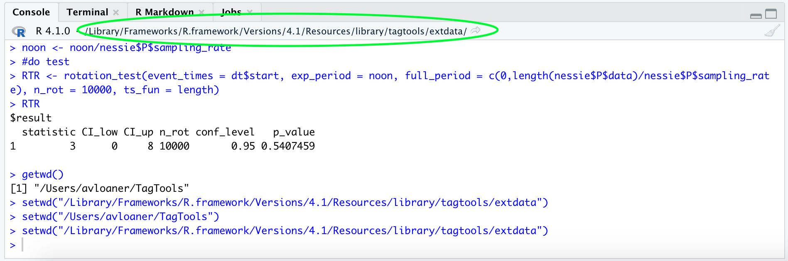
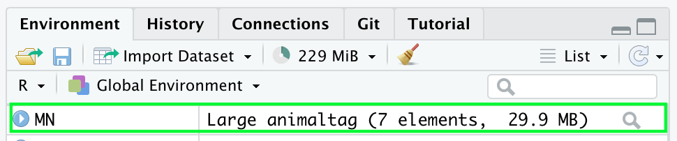

```{r setup, include = FALSE}
knitr::opts_chunk$set(
  collapse = TRUE,
  comment = "#>"
)
library(tagtools)
```
Welcome to this load tag data vignette! On behalf of the team behind tagtools, thanks for taking some time to get to know our package. We hope it facilitates your work. 

In this vignette, you will gain confidence with using the tagtools to create and load netCDF files, including editing metadata. 

*Estimated time for this vignette: about 20 minutes.*

These vignettes assume that you have some basic experience working with R/Rstudio, and can execute provided code, making some user-specific changes along the way (e.g. to help R find a file you downloaded). We will provide you with quite a few lines. To boost your own learning, you would do well to try and write them before opening what we give, using this just to check your work. Additionally, be careful when copy-pasting special characters such as \_underscores\_, and 'quotes'. If you get an error, one thing to check is that you have just a single, simple underscore, and 'straight quotes', whether 'single' or "double" (rather than “smart quotes”). 

# Loading an .nc File

##  Load the test data set
For this example, you will load in the data file from a CATs tag. The data file is already stored in a .nc file called 'cats_test_raw.nc'. This dataset is built into the `tagtools` package, so you can access it using `system.file`. Click Code at the right to see how.

```{r, eval=TRUE, echo=TRUE}
library(tagtools)
cats_file_path <- system.file("extdata", "cats_test_raw.nc", package = "tagtools", mustWork = TRUE)
MN <- load_nc(cats_file_path)
```

This especially concise two-line method should always work with the installation of `tagtools` that we support, for all eight built-in datasets that come with the package. We will make frequent use of this method in these vignettes. It is especially nice because it saves you some annoying hassle (of tracking down where the dataset is saved and setting your working directory there, or of figuring out what your working directory is and moving your dataset there). 

**However**, it is worth your while to understand how to do these steps manually, though this requires its own separate mental task, because you will have to do this in the real world when you get your own data from somewhere else. You should keep track of what your working directory is for other reasons, too. So, familiarize yourself with the following commands:

```{r, echo = TRUE, eval = FALSE}
getwd() # prints your current working directory. Often this will not be a tidy folder, but contain other things. So, to avoid that... 
setwd("/Path/To/Working/Directory/In/Quotes") # on Mac or Linux, paths look like this, with forward slashes between folders. For instance:
setwd("/Library/Frameworks/R.framework/Versions/4.1/Resources/library/tagtools/extdata/") # depending on your system, this may set your working directory to the folder containing the built-in datasets
setwd("C:\Users\Sam Fynewever\Program Files") # on Windows, paths look like this, with a letter and colon at the beginning, then backslashes between folders
```

Additionally, your working directory should be visible at the top of the console: 

```{r, echo = FALSE}

```

Now, if you have navigated to your working directory in your file finder and/or ensured that the dataset file, `cats_test_raw.nc`, is located there (whether by changing your working directory or copy-pasting the file into your working directory), you can run load_nc "by hand"---see code:

```{r, echo = TRUE, eval = FALSE}
MN <- load_nc("cats_test_raw") # no .nc required this way!
```

All right! Whichever way you have just run `MN <- load_nc(...)`, this creates an animaltag list object `MN` in your workspace. You can view it in the Environment tab if working in RStudio. 

```{r, echo = FALSE}

```

Or in the command line/console, type:

```{r, echo = TRUE, eval=FALSE}
names(MN)
str(MN, max.level = 1)
str(MN$A)
```

<button class="btn btn-primary" data-toggle="collapse" data-target="#MN_struct"> Show/Hide Results </button>  
<div id="MN_struct" class="collapse"> 

```{r, echo = FALSE, eval = TRUE}
print("First the results for names(MN):")
print("--------------------------------------------")
names(MN)
print("Then the results for str(MN, max.level = 1):")
print("--------------------------------------------")
str(MN, max.level = 1)
print("and finally the results for str(MN$A):")
print("--------------------------------------------")
str(MN$A)
```

</div>

You should see that variables Acc, Gyr, Depth, Light, and info are contained within the list MN.

# Explore the test dataset

Now you can find out what each of the variables is by just typing their name followed by enter. For example, for info (tag-wide metadata), run

```{r, echo = TRUE, eval = FALSE}
MN$info
```

<button class="btn btn-primary" data-toggle="collapse" data-target="#MN_info"> Show/Hide Results </button>  
<div id="MN_info" class="collapse"> 

```{r, echo = FALSE, eval=TRUE}
MN$info
```

</div>

The `info` structure tells you where the data came from, when it was collected, on what animal, and with what type of tag. info is the general metadata store for a dataset. You can find out what is in a specific field in info, e.g., to get the `sensors_list`: 

```{r, eval = FALSE, echo = TRUE}
MN$info$sensors_list
```

<button class="btn btn-primary" data-toggle="collapse" data-target="#MN_info_sensors_list"> Show/Hide Results </button>  
<div id="MN_info_sensors_list" class="collapse"> 

```{r,eval=TRUE, echo = FALSE}
MN$info$sensors_list
```

</div>

##  Updating and adding metadata
There is a lot of metadata missing from this file! `read_cats()` can only auto-fill it with information that is standard for all CATS tags, or contained in the file itself.  Other metadata must be added by the user.

For example, to add a field called 'data\_owner' with value 'Jeremy Goldbogen, Dave Cade', you would enter:

```{r, echo = TRUE, eval = FALSE}
MN$info$data_owner <- 'Jeremy Goldbogen, Dave Cade'
MN$info$data_owner
```

<button class="btn btn-primary" data-toggle="collapse" data-target="#MN_info_data_owner"> Show/Hide Results </button>  
<div id="MN_info_data_owner" class="collapse"> 

```{r, eval = TRUE, echo = FALSE}
MN$info$data_owner <- 'Jeremy Goldbogen, Dave Cade'
MN$info$data_owner
```

</div>

This is a way to add metadata to a dataset before sending it off to an archive (e.g., a dataset to accompany a journal paper). Although there are no rules for what you call each field, we are working toward establishing a set of best practices. 

Entering metadata by hand by typing it into the R console is tedious, and also a recipe for inconsistencies. (Let's avoid that!) To that end, we have tried to provide a couple of other options, considered below. 

## Saving Metadata with make_info
You can use `make_info()` to create a metadata info structure with information about the researcher, tag type, and study species. This function allows the user to generate a "skeleton" info structure for a tag deployment, with some common pieces of metadata filled in. Additional information can then be added manually or using a custom script before saving this info as part of a netCDF (.nc) file.

For example,

```{r, eval = FALSE, echo = TRUE}
more_info <- make_info(depid = 'cats_test', tagtype = 'CATS', 
                       species = 'mn', owner = 'jg')
# results a few chunks later
```

Note that you may need to add researchers, species, and perhaps tag types to the template files. To find out where these are stored on your machine, you can run:

```{r, echo = TRUE, eval = FALSE}
system.file('extdata', 'researchers.csv', package='tagtools')
```

<button class="btn btn-primary" data-toggle="collapse" data-target="#system_file_researchers"> Show/Hide Results </button>  
<div id="system_file_researchers" class="collapse"> 

```{r, eval = TRUE, echo = FALSE}
system.file('extdata', 'researchers.csv', package='tagtools')
```

</div>

Then, navigate to the folder and make any edits that you would like. You may need to restart R before they will take effect.

Once you have succeeded in running `make_info()`, you can view the results:

```{r, eval = FALSE, echo = TRUE}
more_info
```

<button class="btn btn-primary" data-toggle="collapse" data-target="#more_info"> Show/Hide Results </button>  
<div id="more_info" class="collapse"> 

```{r, echo = FALSE, eval = TRUE}
more_info <- make_info(depid = 'cats_test', tagtype = 'CATS', 
                       species = 'mn', owner = 'jg')
more_info
```

</div>

## Combining info and more_info
Now we have two different info structures---the one we just created with `make_info()` and the one we got when we created the .nc file using `read_cats()`.

We can combine the two together, keeping the fields from the original info if there are any duplicates:

```{r, eval = FALSE, echo = TRUE}
more_info[names(MN$info)] <- MN$info
MN$info <- more_info
MN$info
```

<button class="btn btn-primary" data-toggle="collapse" data-target="#more_info2"> Show/Hide Results </button>  
<div id="more_info2" class="collapse"> 

```{r, eval = TRUE, echo = FALSE}
more_info[names(MN$info)] <- MN$info
MN$info <- more_info
MN$info
```

</div>

## Saving metadata with a GUI editor
Another option for entering user-generated metadata is to use the animaltags metadata editor. This interface allows you to type your information into pre-named fields, allowing you to fully customize the information while also using standard field names.

To launch the editor, run:

```{r, eval = FALSE, echo = TRUE}
metadata_editor()
```

A web browser window will open in which you can fill in metadata fields for your tag.

```{r, echo = FALSE, eval = TRUE}
knitr::include_graphics('meta_editor.png')
```

Depending on your individual platform, this editor may not have any of the tabs open. Simply click on one of the tabs (Device Information, Tag and Animal Information, etc.) to open it. 

Perhaps you don't currently have metadata on hand to fill in the fields yourself. Or, at some point you might already have metadata stored in a CSV spreadsheet, *in the specific format that this reader recognizes* (it will not magically pick out metadata saved in a CSV in any order of your choosing). In either case, the function that reads metadata for you from a `.csv` file is useful. There should be a .csv spreadsheet with metadata in your workshop materials that you can use for now. Upload it with "Browse", then click "Open from CSV" to harvest the data. This will automate the data entry process for you.

When you are done, scroll to the bottom of the editor, fill in a file name under which to save your work, and click "Save". *Note that there are a number of fields which we strongly suggest filling out...you will get a warning if you try to save with these left blank.*  You can choose where on your computer to save this (temporary) file, and it should confirm what the file name is.

Then, once this file is in your working directory, you can load the info into R as an animaltags info structure via:

```{r, eval = FALSE}
yet_more_info <- csv2struct('the_file_you_just_saved.csv')
# results not included, will depend on your individual file
```

And finally, combine it with the rest as before. Try to emulate the two lines from above, changing the names as needed, without opening the chunk below. Then check your work against this:

```{r, eval = FALSE}
yet_more_info[names(MN$info)] <- MN$info
MN$info <- yet_more_info
```

# Saving the data
We've now made quite a few additions to the metadata in the `info` structure, and we probably want to save those to our .nc file. Here's how. 

```{r, eval = FALSE}
MN$info[is.na(MN$info)] <- NULL
add_nc('cats_test_raw', X = MN$info, vname = 'info') 
```

That's it! If all has worked smoothly, your .nc file will contain all the additions we've been working on. 

# Review

What have you learned so far? More important steps that will hopefully, as you're working with data more frequently, become healthy routines of consistent, rigorous documentation. 

Great work!

*If you'd like to continue working through these practicals, `vectors-vs-structures` and `plots-and-cropping` are two good choices.* 

*`vectors-vs-structures` is a quick overview of the way R stores data in structures, and how these can be extracted to individual vectors/scalars.* 

```{r, echo = TRUE, eval = FALSE}
vignette('vectors-vs-structures', package = 'tagtools')
```

*In `plots-and-cropping`, you'll get to start visualizing some data of the types you've been learning to load.* 

```{r, echo = TRUE, eval = FALSE}
vignette('plots-and-cropping', package = 'tagtools')
```

***

Animaltags home pages: http://animaltags.org/ (old), https://animaltags.netlify.app/ (new), https://github.com/stacyderuiter/TagTools (for source code)