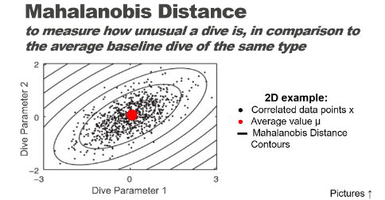

```{r setup, include = FALSE}
knitr::opts_chunk$set(
  collapse = TRUE,
  comment = "#>"
)
library(tagtools)
```

Welcome to the Mahalanobis distance vignette! Thanks for taking some time to get to know our package. We hope it empowers you to make the world a better place for marine mammals. 

In this vignette you will learn to use the function `m_dist`, which stands for Mahalanobis distance. You will use `m_dist` to consider the effect of military sonar on a Cuvier's beaked whale. 

*Estimated time for this vignette: 25 minutes.*

These practicals all assume that you have R/Rstudio, some basic experience working with them, and can execute provided code, making some user-specific changes along the way (e.g. to help R find a file you downloaded). We will provide you with quite a few lines. To boost your own learning, you would do well to try and write them before opening what we give, using this just to check your work.

Additionally, be careful when copy-pasting special characters such as \_underscores\_ and 'quotes'. If you get an error, one thing to check is that you have just a single, simple underscore, and `'straight quotes'`, whether `'single'` or `"double"` (rather than “smart quotes”). 

# What is Mahalanobis distance?

Put concisely, Mahalanobis distance is a way of comparing how different some data is to what we would expect it to be like. By plotting more than one variable and seeing what the distribution is like graphically, we can determine more accurately how out-of-the-ordinary something is by computing the distance from that point to the centroid of the points. The picture below is taken from Schwarz et al. 2012, J. Neuroscience Methods 206(2): 120-131 and appears in the "Statistics for "Tag Data" lecture on the animaltags website. 

```{r, echo = FALSE, eval = TRUE}

```

See [this blog post](https://blogs.sas.com/content/iml/2012/02/15/what-is-mahalanobis-distance.html) for another explanation of Mahalanobis distance. You can also consult slides on this topic in the "Statistics for Tag Data" lecture on the animaltags website, http://animaltags.org/ or https://animaltags.netlify.app .

# Load & inspect data

Consider again the dataset zc11_267a. It is built into the `tagtools` package, so you can access it using `system.file`.

```{r, echo = TRUE, eval = FALSE}
library(tagtools)
ZC_file_path <- system.file("extdata", "zc11_267a.nc", package = "tagtools", mustWork = TRUE)
zc <- load_nc(ZC_file_path)
str(zc, max.level = 1)
plott(X = list(Depth = zc$P$data, Accel = zc$A$data), fsx = zc$P$sampling_rate, interactive = TRUE)
```

<button class="btn btn-primary" data-toggle="collapse" data-target="#load_inspect_zc"> Show/Hide Results </button>  
<div id="load_inspect_zc" class="collapse">

```{r, echo = FALSE, eval = TRUE}
ZC_file_path <- system.file("extdata", "zc11_267a.nc", package = "tagtools", mustWork = TRUE)
zc <- load_nc(ZC_file_path)
str(zc, max.level = 1)
plott(X = list(Depth = zc$P$data, Accel = zc$A$data), fsx = zc$P$sampling_rate, interactive = FALSE)
```

</div>

1. How might you use Mahalanobis distance to summarise the multivariate tag data into a single data stream? What input variables might you choose to try to quantify how the whale might have changed its behavior in response to sonar sounds? (If you need more context, you can check out the paper at http://rsbl.royalsocietypublishing.org/content/9/4/20130223.)

2. Use the tag tool function m_dist to compute the Mahalanobis distance using your chosen inputs, using the model below as a guide (note that these choices of inputs are kind of ridiculous---do better!). You will have to choose an averaging window length and a between-window overlap. You can use the experiment start and end times provided. How would you justify these choices?

```{r, echo = TRUE, eval = FALSE} 
MDdata <- data.frame(jerk = njerk(zc$A, sampling_rate = zc$A$sampling_rate)$data, Mx = zc$P$data)
est <- as.numeric(as.POSIXct('2011-09-24 14:45:00') - as.POSIXct(zc$info$dephist_device_datetime_start))*3600
eet <- as.numeric(as.POSIXct('2011-09-24 15:15:00') - as.POSIXct(zc$info$dephist_device_datetime_start))*3600
MD <- m_dist(data = MDdata, sampling_rate=zc$P$sampling_rate, smoothDur = 10, overlap = 9.5, expStart = est, expEnd = eet)
plot(MD$t, MD$dist, type = 'l')
```

<button class="btn btn-primary" data-toggle="collapse" data-target="#MD_and_plot"> Show/Hide Results </button>  
<div id="MD_and_plot" class="collapse">

```{r, echo = FALSE, eval = TRUE} 
MDdata <- data.frame(jerk = njerk(zc$A, sampling_rate = zc$A$sampling_rate)$data, Mx = zc$P$data)
est <- as.numeric(as.POSIXct('2011-09-24 14:45:00') - as.POSIXct(zc$info$dephist_device_datetime_start))*3600
eet <- as.numeric(as.POSIXct('2011-09-24 15:15:00') - as.POSIXct(zc$info$dephist_device_datetime_start))*3600
MD <- m_dist(data = MDdata, sampling_rate=zc$P$sampling_rate, smoothDur = 10, overlap = 9.5, expStart = est, expEnd = eet)
plott(X=list(MahalanobisDist = MD$dist), fsx = zc$A$sampling_rate)
```

</div>

3. If you included dive depth as an input variable, how did it affect the resulting distance metric? Why do you think that is? Could there be another, better way to include information about dive profile in the Mahalanobis distance metric?

4. Do you think there was a "change" in behavior in response to the sonar exposure?

5. If you wanted to set a threshold for detecting a "change", how would you do it?

# Review

You've learned to use `m_dist` to calculate Mahalanobis distance with some real-world data. Well done!

*If you'd like to continue working through these vignettes, consider `rotation-test` or `fine-scale-tracking`.* 

```{r, echo = TRUE, eval = FALSE}
vignette('rotation-test')
vignette('fine-scale-tracking')
```

*** 

Animaltags home pages: http://animaltags.org/ (old), https://animaltags.netlify.app/ (new), https://github.com/stacyderuiter/TagTools (for latest beta source code), https://stacyderuiter.github.io/TagTools/articles/TagTools (vignettes overview)
