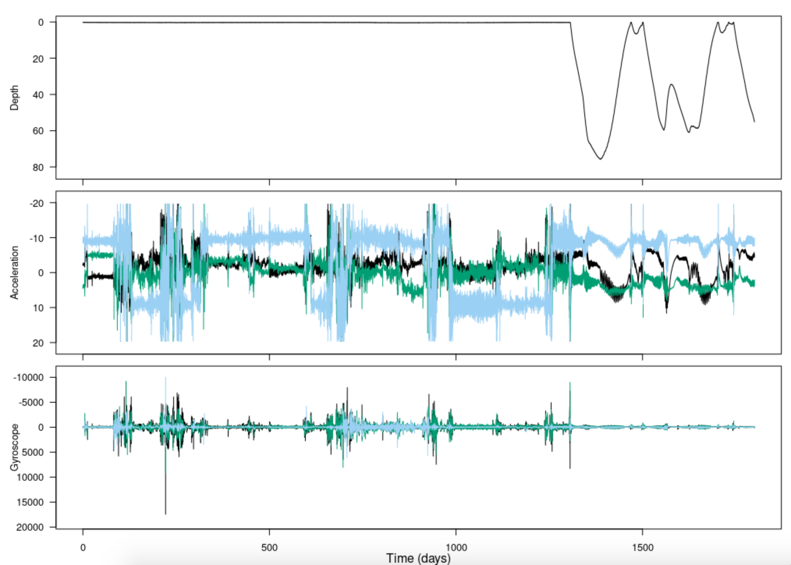

```{r setup, include = FALSE}
knitr::opts_chunk$set(
  collapse = TRUE,
  comment = "#>"
)
require(tagtools)
```

Welcome to the plot and cropping vignette! On behalf of the team behind tagtools, thanks for taking some time to get to know our package. We hope it is useful to you. 

In this vignette, you will start to create some beautiful plots from the data we've been working with, as well as crop these to remove irrelevant data (e.g. before or after a tag was deployed on an animal).

*Estimated time for this practical: 25 minutes.*

These vignettes assume that you have some basic experience working with R/Rstudio, and can execute provided code, making some user-specific changes along the way. We will provide you with quite a few lines. To boost your own learning, you would do well to try and write them before opening what we give, using this just to check your work.

# Setup: write "cats_test_raw.nc", and load it as a large list, `MN`
For this example, we will make use of a CATS tag data file that is already stored in a .nc file called 'cats_test_raw'.

The 'load-tag-data' vignette has details on installing the `tagtools` package, making sure it is loaded in your library (`library(tagtools)`), and loading a .nc data file. If you've just finished one of those within the same R session, great work--move on to [Exploratory data plots]. If not, then we'll get you up to speed on the details you need to move forward from there. Check your working directory (`getwd`). Do you see your .nc file in there? If you do, you're almost all set! Just run the following to load it: 

```{r, echo = TRUE, eval = FALSE}
MN <- load_nc('cats_test_raw')
```

If you don't see cats_test_raw.nc, see the load-tag-data vignette for more details.

```{r, echo = FALSE, eval = TRUE}
cats_file_path <- system.file("extdata", "cats_test_raw.nc", package = "tagtools", mustWork = TRUE)
MN <- load_nc(cats_file_path)
```

# Exploratory data plots
The tag toolbox has a function for plotting tag sensor data without getting it out of the structure:

```{r, eval=FALSE, echo = TRUE}
plott(X = list(Depth = MN$Depth, Acceleration = MN$Acc, Gyroscope = MN$Gyr), interactive = FALSE)
```

<button class="btn btn-primary" data-toggle="collapse" data-target="#plott1"> Show/Hide Results </button>  
<div id="plott1" class="collapse"> 

```{r, eval=TRUE, echo = FALSE}

```

</div>

Notice that there are two t's in this function name: `plott()`. `plott()` is a general purpose tag data plotter; a few of its key features are:

- For depth data, automatically plots on a reversed y-axis: increasing depths going downwards. This is nicer for visualizing a dive as actually going down, and ascent as actually going up, on your screen. 
- "t" stands for "time"; plot*t* also automatically converts the horizontal axis to a convenient time unit like hours or days instead of seconds, or a date-time if the recording start time is given. 
- If input `interactive` is set to TRUE (as in the code above), you can zoom in and out of data using keyboard entries.  
- The first input to `plott()` is the data, which must be in the form of a list (of sensor data lists or of matrices/vectors). Be careful with your data inputs, since, as in the code above, these are often contained within structures. Rather than typing just the variable `Depth`, it was important that you put `MN$depth`. 
- If the list items are named, the names will be used as axis labels.

For more features and info, run the help function `?` with plott:

```{r, echo = TRUE, eval = FALSE}
?plott
```

# Cropping data from a plot
Not all tags have a way to start logging as soon as the tag has been deployed on the animal. Often data logging is started by a time trigger or alarm, and the researcher has to make a guess as to when the tag will be deployed to set its start time appropriately.  Often this means that a tag is logging data before it is put on an animal. Equally tags have no means of detecting when they release from the tagged  animal and as a consequence may continue to log data after they release. In most cases the logged data from before and after deployment has no use. To reduce the data to just the periods when the tag is on the animal, use the tool `crop()`:

```{r, echo = TRUE, eval=FALSE}
Pc = crop(MN$Depth)
```

<button class="btn btn-primary" data-toggle="collapse" data-target="#crop1"> Show/Hide Results </button>  
<div id="crop1" class="collapse"> 
```{r, echo = FALSE, eval = TRUE}
Pc = crop(MN$Depth)
```

</div>

This displays an interactive depth plot. Follow the instructions to select the obvious diving section of the data and then click finish. Alternatively, if you click once on your desired left limit and twice on your desired right limit, finish will click itself and the cropping will be complete. The function returns a new data structure which contains just the selected part of the dive profile. 

Use plott to plot Pc to make sure you cropped it correctly. (Now would be an especially good time to try and write the code yourself, since you've used `plott` once before.)

```{r, eval = FALSE, echo = TRUE}
plott(X=list(Depth = Pc))
```

<button class="btn btn-primary" data-toggle="collapse" data-target="#plott2"> Show/Hide Results </button>  
<div id="plott2" class="collapse"> 
```{r, eval = TRUE, echo = FALSE}
plott(X=list(Depth = Pc))
```

</div> 

If all has gone well, your plott should be absolutely beautiful.

As an alternative to `crop`, if you already know the start and end times (with appropriate units) that you would like to crop the data to, you can use `crop_to`. For instance, to get back something like what you just did with `crop` from the same depth data:

```{r, echo=TRUE, eval = FALSE}
Pc <- crop_to(X=MN$Depth, tcues=c(111195040, 155520000))
```

The resulting sensor data list also contains fields that document what you just did. They should look like:

```{r, echo=FALSE, eval = TRUE}
Pc <- crop_to(X=MN$Depth, tcues=c(111195040, 155520000))
```

```{r, echo = TRUE, eval = TRUE}
Pc$history
```

The history keeps track of the operations that you perform on a data structure. This helps with traceability if you make the processed data available in an archive. The crop and start_time fields show how the original data was changed: the `start_time` is with respect to the field `dephist_device_datetime_start` in the info structure which says when the tag recording started.


# Review 

You've learned how to make plots using the `tagtools` function `plott`, as well as how to crop these plots. 

Congratulations! You've completed this vignette. 

*If you'd like to continue working through these vignettes, *