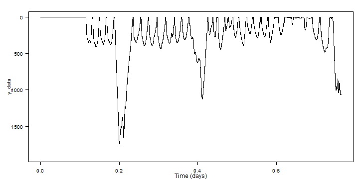
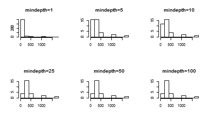
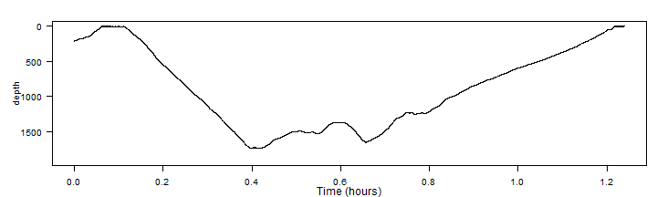

Change Point Detection
========================================================
author: Stacy DeRuiter
date: 8 August 2017
autosize: true
incremental: true

What are we talking about?
========================================================
- Detection [this lecture]
    - Event characteristics known
    - Want to ID times of all instances
- Classification [here, Wednesday]
    - Want to divide time-series (or list of events)
    - Want to group together similar events or time-periods

 What are we talking about?
========================================================
- Identifying and characterizing change points
    - Did experimental treatment "affect behavior"?
    - When did change occur?
    - Overlap with Det., Class.
        - Finding change point = Detection
        - Characterizing before/after behavior = Classification

 Event Detection with tag data
=======================================================
(David)

Classification with tag data
=======================================================
- Group together similar events or time-periods
- "Super-supervised" (today)
    - (Quantitative) criteria available to identify groups
- Supervised (Wednesday)
    - Training data are available to "teach" model about groups to identify
- Unsupervised (Wednesday)
    - User (usually) supplies number of groups to create
    - Groups generated by model based on data
    
Super-supervised classification
=======================================================
- Assign behavior "state" based on presence/absence of...
    - foraging sounds or movements
    - social sounds or movements
    - certain movement patterns
- Detect events via highly stereotyped characteristics (+ human intelligence)
- **Identify dives or flights**
- **Characterize dives/flights**
- **ID and characterize phases of dives/flights**

Why ID and describe dives/flights?
======================================================
- Key behaviors take place underwater/in air
- Differences in structure and characteristics yield insight into function and physiology

Why ID and describe dives/flights?
======================================================
- Example of sperm whale resting dives
- Example of seal drift dives
- Example of blue whale calling
- a bird or penguin example?

Why ID and describe dives/flights?
======================================================
- Interspecific comparisons may be made...
    - if sensor output are comparable
        - Example of TDR vs. full dive record
    - if analysis methods are consistent
- Review: Hooker and Baird, 2001 (Mammal Review, v31, p81-105)

Identifying "excursions"
======================================================
- Simple, right? Leaving surface (or ground) until return.
- Example: running example, zc11\_267a


```r
library(tagtools)
setwd("C:/Users/Stacy DeRuiter/Dropbox/TagTools")
zc11 <- load_nc('data/zc11_267a.nc')
```

Identifying "excursions"
======================================================


```r
plott(X=list(zc11$P), r=TRUE)
```



- (Can you suggest some improvements to the plot?)

Identifying "excursions"
======================================================
- Zooming in (better in Matlab)

```r
plott(X=list(zc11$P), r=TRUE, interactive=TRUE)
```


Identifying "excursions"
======================================================
- Need to determine a *threshold* (minimum dive depth/flight altitude)
    - Include or exclude "surfacings" (breaths) (or hops?)
    - Account for sensor resolution and drift
    - Criterion based on body length or diameter
    - Arbitrary number
    - We're entering the realm of classification!
- *Should add some refs here*

Finding dives/flights given a threshold
=======================================================

```r
dt <- find_dives(zc11$P, mindepth=10)
head(dt)
```

```
    start     end       max    tmax
1     0.2 16082.6  414.5977 12166.2
2 16151.6 20229.6 1737.0414 17324.0
3 20349.0 21933.6  356.2372 21009.8
4 22047.8 23652.8  395.3293 22800.0
5 23727.6 25514.4  390.7887 24499.0
6 25601.8 27450.2  437.5752 26353.2
```

How much does mindepth matter?
=======================================================
- Depends on the situation!
- Here:

```r
mds <- c(1, 5, 10, 25, 50, 100)
all_dt <- data.frame()
par(mfrow=c(2,3))
for (m in 1:length(mds)){
  dt <- find_dives(zc11$P, mindepth=mds[m])
  dt$mindepth <- mds[m]
  all_dt <- rbind(all_dt, dt)
  hist(dt$max, main=paste('mindepth=', mds[m], sep=''))
}
```

How much does mindepth matter?
=======================================================



Challenges of including "all" dives/flights
==========================================================
- Sensor noise may be different near surface/ground
- Kinematics and shape of very short submergences/hops very different
- Inter-breath-intervals (hops?) are *far* more numerous than larger excursions
- Deeper/higher, longer excursions are usually of high biological interest
- Statistical classification methods expect equal group sizes (more tomorrow)

Dividing excursions into phases
==========================================================
- **To**, **From**, and **Destination**


```r
deep_dive <- crop_to(zc11$P, tcues=c(15845, 20307))[[1]]
plott(X=list(depth=deep_dive), r=TRUE)
```



Identifying destination phase
==========================================================
- Pitch-based criterion
- Locomotion-based criterion
- Inflection-point-based criterion
- **Depth/Altitude-based criterion**
    - simple
    - flexible
    - less dependent on stereotypy of dive/flight shape
    - *NOT* always the best choice!

Dive stats example
==========================================================


```
Error in array(x, c(length(x), 1L), if (!is.null(names(x))) list(names(x),  : 
  'data' must be of a vector type, was 'NULL'
```
