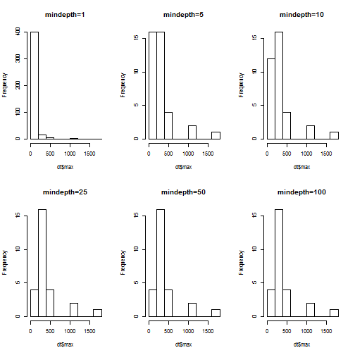
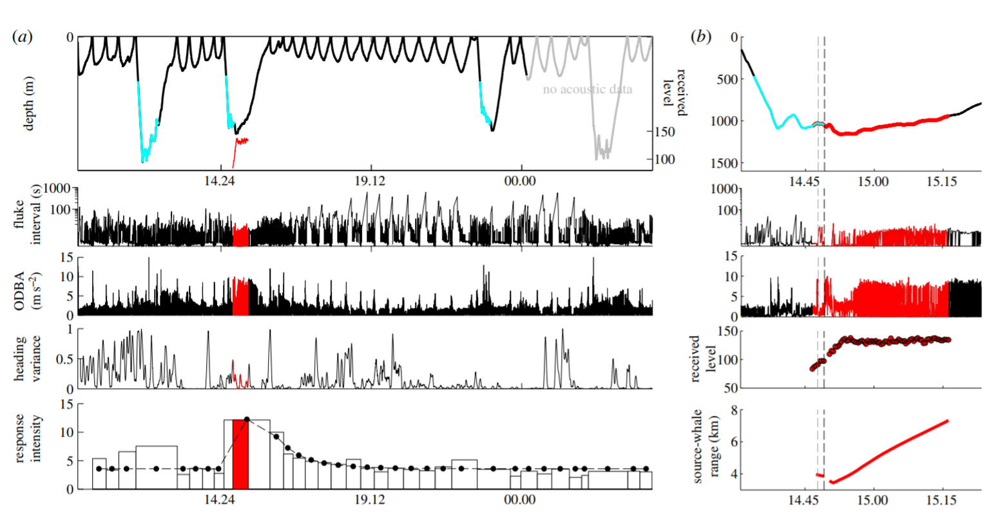

Change Point Detection
========================================================
author: Stacy DeRuiter
date: 8 August 2017
autosize: true
incremental: true

What are we talking about?
========================================================
- Detection [this lecture]
    - Event characteristics known
    - Want to ID times of all instances
- Classification [here, Wednesday]
    - Want to divide time-series (or list of events)
    - Want to group together similar events or time-periods

 What are we talking about?
========================================================
- Identifying and characterizing change points
    - Did experimental treatment "affect behavior"?
    - When did change occur?
    - Overlap with Det., Class.
        - Finding change point = Detection
        - Characterizing before/after behavior = Classification

 Event Detection with tag data
=======================================================
(David)

Classification with tag data
=======================================================
- Group together similar events or time-periods
- "Super-supervised" (today)
    - (Quantitative) criteria available to identify groups
- Supervised (Wednesday)
    - Training data are available to "teach" model about groups to identify
- Unsupervised (Wednesday)
    - User (usually) supplies number of groups to create
    - Groups generated by model based on data
    
Super-supervised classification
=======================================================
- Assign behavior "state" based on presence/absence of...
    - foraging sounds or movements
    - social sounds or movements
    - certain movement patterns
- Detect events via highly stereotyped characteristics (+ human intelligence)
- **Identify dives or flights**
- **Characterize dives/flights**
- **ID and characterize phases of dives/flights**

Why ID and describe dives/flights?
======================================================
- Key behaviors take place underwater/in air
- Differences in structure and characteristics yield insight into function and physiology

Why ID and describe dives/flights?
======================================================
- Example of sperm whale resting dives
- Example of seal drift dives
- Example of blue whale calling
- a bird or penguin example?

Why ID and describe dives/flights?
======================================================
- Interspecific comparisons may be made...
    - if sensor output are comparable
        - Example of TDR vs. full dive record
    - if analysis methods are consistent
- Review: Hooker and Baird, 2001 (Mammal Review, v31, p81-105)

Identifying "excursions"
======================================================
- Simple, right? Leaving surface (or ground) until return.
- Example: running example, zc11\_267a


```r
library(tagtools)
setwd("C:/Users/Stacy DeRuiter/Dropbox/TagTools")
zc11 <- load_nc('data/zc11_267a.nc')
```

Identifying "excursions"
======================================================


```r
plott(X=list(Depth=zc11$P), r=TRUE)
```


- (Can you suggest some improvements to the plot?)

Identifying "excursions" - Visualization
======================================================
- Zooming in (better in Matlab)

```r
plott(X=list(Depth=zc11$P), r=TRUE, 
      interactive=TRUE,
      recording_start=
        zc11$info$dephist_deploy_datetime_start)
```

Identifying "excursions" - Visualization
======================================================
- Improving the figure with ggplot2

```r
library(ggplot2)
library(plotly)
tagon <- as.POSIXct(zc11$info$dephist_device_datetime_start,
                    tz='America/Los_Angeles')
z <- data.frame(Depth=zc11$P$data, 
                Time=c(1:length(zc11$P$data))/
                  zc11$P$sampling_rate + tagon)
f <- ggplot(z, aes(x=Time, y=Depth)) + 
  geom_line() + ylim(2000,-25) + 
  theme_bw(base_size=20)
```

Plotly visualizations
=================================================


```r
f
```



```r
#ggplotly(f + theme_bw(base_size=12))
```

- Another example: <http://shiny.calvin.edu/sld33/birds>

Identifying "excursions"
======================================================
- Need to determine a *threshold* (minimum dive depth/flight altitude)
    - Include or exclude "surfacings" (breaths) (or hops?)
    - Account for sensor resolution and drift
    - Criterion based on body length or diameter
    - Arbitrary number
    - We're entering the realm of classification!

Insights from 16 years ago
======================================================
How can we discriminate surface and deeper dives?

- Hooker & Baird 2001
- "deeper" = more than twice the sensor resolution
- subjective, arbitrary declaration 
  - "Foraging dives were any dives to greater than 150 m..."
- multivariate statistics, machine learning
  - cluster analysis
  - neural networks
- plot dive frequency vs. depth, duration and look for peaks (Boveng et al. 1996)

3D dive depth, duration, frequency plot
=======================================================


(figure from Hooker & Baird 2001)

Insights from 16 years ago continued
=======================================================
- Log survivorship plot
- Cumulative time vs. dive duration


Objectivity?
=======================================================
- Any missing methods/ideas?
- Can you put these in order of increasing "objectivity"?

Finding dives/flights given a threshold
=======================================================

```r
dt <- find_dives(zc11$P, mindepth=10)
head(dt)
```

```
    start     end       max    tmax
1     0.2 16082.6  414.5977 12166.2
2 16151.6 20229.6 1737.0414 17324.0
3 20349.0 21933.6  356.2372 21009.8
4 22047.8 23652.8  395.3293 22800.0
5 23727.6 25514.4  390.7887 24499.0
6 25601.8 27450.2  437.5752 26353.2
```

How much does mindepth matter?
=======================================================
- Depends on the situation!
- Here:

```r
mds <- c(1, 5, 10, 25, 50, 100)
all_dt <- data.frame()
par(mfrow=c(2,3))
for (m in 1:length(mds)){
  dt <- find_dives(zc11$P, mindepth=mds[m])
  dt$mindepth <- mds[m]
  all_dt <- rbind(all_dt, dt)
  hist(dt$max, main=paste('mindepth=', mds[m], sep=''))
}
```

How much does mindepth matter?
=======================================================


Challenges of including "all" dives/flights
==========================================================
- Sensor noise may be different near surface/ground
- Kinematics and shape of very short submergences/hops very different
- Inter-breath-intervals (hops?) are *far* more numerous than larger excursions
- Deeper/higher, longer excursions are usually of high biological interest
- Statistical classification methods expect equal group sizes (more tomorrow)

Dividing excursions into phases
==========================================================
- **To**, **From**, and **Destination**


```r
deep_dive <- crop_to(zc11$P, tcues=c(15845, 20307))[[1]]
plott(X=list(depth=deep_dive), r=TRUE)
```


Identifying destination phase
==========================================================
- Pitch-based criterion
- Locomotion-based criterion
- Inflection-point-based criterion
- **Depth/Altitude-based criterion**
    - simple
    - flexible
    - less dependent on stereotypy of dive/flight shape
    - *NOT* always the best choice!

Dive stats example
==========================================================

```r
zc11$P <- crop_to(zc11$P, tcues=c(9850, 66100))$X
dt <- find_dives(zc11$P, mindepth=25)
ds <- dive_stats(P=zc11$P, dive_cues=dt[,c('start','end')])
str(ds)
```

```
'data.frame':	27 obs. of  10 variables:
 $ num      : int  1 2 3 4 5 6 7 8 9 10 ...
 $ max      : num  415 1737 356 395 391 ...
 $ dur      : num  6233 4078 1585 1605 1787 ...
 $ dest_st  : num  1068 970 286 469 465 ...
 $ dest_et  : num  5740 2226 877 1081 1087 ...
 $ dest_dur : num  4672 1255 590 612 623 ...
 $ to_dur   : num  1068 970 286 469 465 ...
 $ to_rate  : num  0.328 1.52 1.055 0.716 0.714 ...
 $ from_dur : num  492 1852 708 525 700 ...
 $ from_rate: num  -0.714 -0.797 -0.427 -0.64 -0.475 ...
```

Dive stats example with auxiliary data
==========================================================

```r
zc11$A <- crop_to(zc11$A, tcues=c(9850, 66100))$X
ds <- dive_stats(P=zc11$P, X=msa(zc11$A),
                 dive_cues=dt[,c('start','end')])
str(ds)
```

```
'data.frame':	27 obs. of  18 variables:
 $ num          : int  1 2 3 4 5 6 7 8 9 10 ...
 $ max          : num  415 1737 356 395 391 ...
 $ dur          : num  6233 4078 1585 1605 1787 ...
 $ dest_st      : num  1068 970 286 469 465 ...
 $ dest_et      : num  5740 2226 877 1081 1087 ...
 $ dest_dur     : num  4672 1255 590 612 623 ...
 $ to_dur       : num  1068 970 286 469 465 ...
 $ to_rate      : num  0.328 1.52 1.055 0.716 0.714 ...
 $ from_dur     : num  492 1852 708 525 700 ...
 $ from_rate    : num  -0.714 -0.797 -0.427 -0.64 -0.475 ...
 $ mean_aux     : num  8.8 8.8 8.8 8.8 8.81 ...
 $ aux_sd       : num  0.0419 0.0408 0.025 0.0232 0.024 ...
 $ mean_to_aux  : num  8.78 8.81 8.81 8.81 8.81 ...
 $ mean_dest_aux: num  8.8 8.8 8.81 8.81 8.81 ...
 $ mean_from_aux: num  8.79 8.8 8.8 8.8 8.8 ...
 $ to_aux_sd    : num  0.0647 0.0263 0.0326 0.0158 0.021 ...
 $ dest_aux_sd  : num  0.0342 0.0448 0.0175 0.0231 0.0161 ...
 $ from_aux_sd  : num  0.035 0.0434 0.0266 0.0256 0.0292 ...
```


Plotting the dive stats output
==========================================================

```r
par(las=1, mar=c(3,7,1,1))
boxplot(ds, horizontal=TRUE)
```

Plotting the dive stats output
==========================================================


Plotting the dive stats output
==========================================================

```r
par(las=1, mar=c(3,8,1,1))
dss <- ds/matrix(apply(ds, 2, FUN=function(x) max(abs(x), na.rm=TRUE)),
                 nrow=nrow(ds), ncol=ncol(ds), byrow=TRUE)
boxplot(dss, horizontal=TRUE)
```

Plotting the dive stats output
==========================================================


 Detecting change-points in tag data
=======================================================
- Identifying and characterizing change points
    - Did experimental treatment "affect behavior"?
    - When did change occur?
    - Overlap with Det., Class.
        - Finding change point = Detection
        - Characterizing before/after behavior = Classification
        
Did _________ Change?
========================================================
From our running *Ziphius* example - is there a sonar effect?


Did _________ Change?
========================================================
- What are the challenges of identifying "behavior change"?
    - Vagueness about type of change sought
    - Variability of animal behavior
    - Conflicing information from different data streams
    
Did _________ Change?
========================================================    
- Humans extremely skilled at detecting patterns and synthesizing information from multiple visual data sources
- This job is VERY HARD for a computer -- why?
    - we need to tell the computer what to expect, and specify exactly what and how things will change when "something changes."
    - most common change-point detection algorithms rely on conditions that are *not* met by tag data!

Simple change-point detection
========================================================

```r
library(changepoint)
set.seed(1)
x=c(rnorm(100,0,1),rnorm(100,10,1))
plot(c(1:length(x)), x, type='l', xlab='Index', ylab='Data')
```


Simple change-point detection
========================================================

```r
C <- cpt.mean(x, penalty='BIC', method='AMOC')
summary(C)
```

```
Created Using changepoint version 2.2.2 
Changepoint type      : Change in mean 
Method of analysis    : AMOC 
Test Statistic  : Normal 
Type of penalty       : BIC with value, 10.59663 
Minimum Segment Length : 1 
Maximum no. of cpts   : 1 
Changepoint Locations : 100 
```

Simple change-point detection
========================================================
Maybe that was too easy...


```r
library(changepoint)
set.seed(1)
x=c(rnorm(100,0,1),rnorm(100,2,1))
plot(c(1:length(x)), x, type='l', xlab='Index', ylab='Data')
```


Simple change-point detection
========================================================
Maybe that was too easy...


```r
C1 <- cpt.mean(x, penalty='BIC', method='AMOC', class=TRUE)
summary(C1)
```

```
Created Using changepoint version 2.2.2 
Changepoint type      : Change in mean 
Method of analysis    : AMOC 
Test Statistic  : Normal 
Type of penalty       : BIC with value, 10.59663 
Minimum Segment Length : 1 
Maximum no. of cpts   : 1 
Changepoint Locations : 100 
```

Simple change-point detection
========================================================
Maybe that was too easy...


```r
C1 <- cpt.mean(x, penalty='BIC', method='AMOC', class=FALSE)
C1
```

```
        cpt  conf.value 
100.0000000   0.9064313 
```


Multiple change points
================================================================


```r
x <- c(rnorm(100,0,1), rnorm(100,2,1), rnorm(50,5,1))
plot(c(1:length(x)), x, type='l', xlab='Index', ylab='Data')
```


Multiple change points
================================================================


```r
C4 <- cpt.mean(x, method='BinSeg')
summary(C4)
```

```
Created Using changepoint version 2.2.2 
Changepoint type      : Change in mean 
Method of analysis    : BinSeg 
Test Statistic  : Normal 
Type of penalty       : MBIC with value, 16.56438 
Minimum Segment Length : 1 
Maximum no. of cpts   : 5 
Changepoint Locations : 100 200 
Range of segmentations:
     [,1] [,2] [,3] [,4] [,5]
[1,]  200   NA   NA   NA   NA
[2,]  200  100   NA   NA   NA
[3,]  200  100  245   NA   NA
[4,]  200  100  245  202   NA
[5,]  200  100  245  202    3

 For penalty values: 585.5256 200.4977 7.308779 3.853319 3.375176 
```

But that was still too easy...
===============================================================
- Univariate case
- In example, only mean changed (not variance), equal variances
   - (That's relatively easy to relax)
- Using means (or means and variances)
- Methods (with quite different results!) for:
  - AMOC (At Most One Change)
  - Epidemic change (changes, then goes back)
  - Multiple change points
- **Assumption of independence of data points**

Multivariate change-point detection
========================================================
- Similar methods as before, but multiple data streams
- Can we assume **equal** means and variances same between streams?
- Can we assume **same magnitude of change** between streams?
- Can we assume **data streams independent** (other than cp)?
- Can we assume **no lag in the change** from one time-series to the next?
- Do we **know** how many change points there are?
- The more you answer **NO**, the more the methods available thin out!

Does it work anyway?
========================================================
- What happens if we naively apply simple change point detectors to tag data?


```r
jk <- njerk(zc11$A)
plott(X=list(jerk=jk), fsx=zc11$A$sampling_rate)
```


Change-points detected:
===========================================================

```r
summary(cpt.mean(jk, method='BinSeg', penalty='BIC', Q=30))
```

```
Created Using changepoint version 2.2.2 
Changepoint type      : Change in mean 
Method of analysis    : BinSeg 
Test Statistic  : Normal 
Type of penalty       : BIC with value, 25.093 
Minimum Segment Length : 1 
Maximum no. of cpts   : 30 
Number of changepoints: 24 
Number of segmentations recorded: 30  with between  30  and  1 changepoints.
 Penalty value ranges from: 21.33069  to  417.4178
```

Naively trying out the change-point detection
===============================================================
- Is the answer right?
- Maybe...and no...p-values are almost certainly wrong.
- If the user has to decide whether it "worked" and adjust settings/assumptions, then why do the procedure?

Devilish dependence on settings
========================================================
- depending on how many change points you expect, the results change
- blanking time between changes changes results
- black box algorithms with mysterious settings e.g. matlab findchangepts 'MinThreshold'

Are there alternatives?
========================================================
- Methods for multivariate, dependent data
    - [http://www.lancs.ac.uk/~khaleghi/](http://www.lancs.ac.uk/~khaleghi/)
- Slightly more sophisticated way of doing "broken stick" or mean-based CP: package **segmented** in R
    - "Fits regression models with segmented relationships between the response and one or more explanatory variables. Break-point estimates are provided."
- Just apply peak detection to univariate data? 
    - Data should not be the raw data then, but some summary of "what you think might be changing".
    
(Simple-minded?) Example
==================================================================


(Simple-minded?) Example
==================================================================


Frustrations remain
==================================================================

- Set threshold via resampling from baseline period?
- (But need to retain order of observations, because they are not independent...)
- Simple rule: maximum observed in baseline?
- More "conservative": X*max(baseline)?
- Argh! Let's talk more tomorrow...
