Event Detection
========================================================
author: David Sweeney 
date: 8 August 2017
autosize: true
incremental: true


Event Detection Theory
========================================================

- What is event detection?
    - The process of discerning between noise and a behavioral event
    
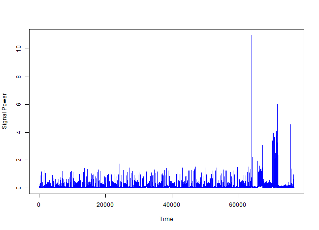


Noise vs. Signal
========================================================

- What is noise?
    - Irrelevant and undesired stimuli
- What is an event?
    - Informative and unique signal stimuli characteristic of a behavioral event
- Event detection is impossible without noise
    

Detection Threshold
========================================================

- What is a threshold?
    - A ratio of event signal power to noise power (_Principles of Underwater Sound for Engineers_ by Robert Urick)
- A signal that exceeds this ratio constitutes a detected behavior event

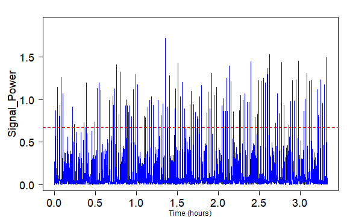

    
Setting a Threshold
========================================================

- The goal is to have the largest ratio of true positive detections to false positive detections
- Thresholds that are too high:
    - Many missed detections
    - Not many false positive and true positive detections

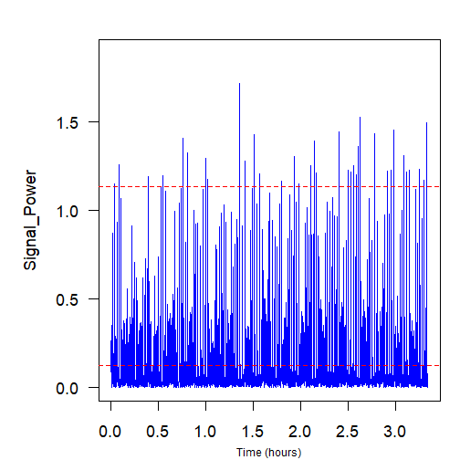


Setting a Threshold
========================================================

- Thresholds that are too low:
    - Many false positive and true positive detections

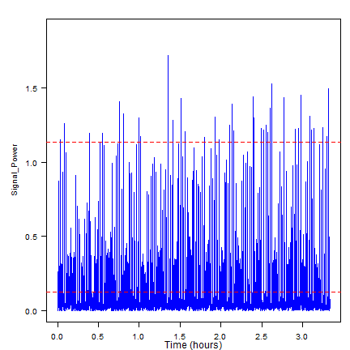


Optimal Threshold
========================================================

- High rate of true positive detections
- Low rate of false positive detections
- As few missed detections as possible
- Receiver Operating Characteristic (ROC) curve ...

Blanking Time
========================================================

- What is a blanking time?
    - Amount of time within which all values exceeding the threshold level constitute the same signal
    
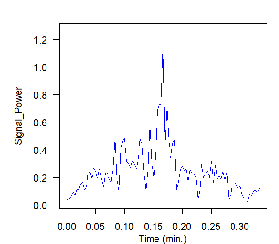


Setting the Blanking Time
========================================================

- Blanking times account for the physical and/or physiological constraints of animal behaviors
- What is the necessary time required between successive behavior events?

<div align='center'>

<font size=4> 
<br>(photo from http://extrememarine.org.uk/2016/12/sperm-whales-a-deep-sea-odyssey/)
</font>
</div>


ROC Curves
========================================================

- Three main Purposes:
    - Assess overall performance of event detector
    - Help set the optimal threshold level
    - Compare performance of different detectors on the same data
    

ROC Curves
========================================================

- The more area under the curve, the better the performance of the detector
<div align='center'>

<font size=4> 
<br>(photo from https://openi.nlm.nih.gov/detailedresult.php?img=PMC3861891_CG-14-397_F10&req=4)
</font>
</div>


Case Study: Detecting Lunge Feeding Events
========================================================

<div align='center'>

<font size=4> 
<br>(photo from http://www.norbertwu.com/nwp/subjects/bluewhales_web/gallery-02.html)
</font>
</div>


What whale is this?
========================================================

Data is from the whale bw11_210a which was tagged on 29 July 2011


<font size=3>
<br>(photo from http://sea-inc.net/socal-brs/)
</font>
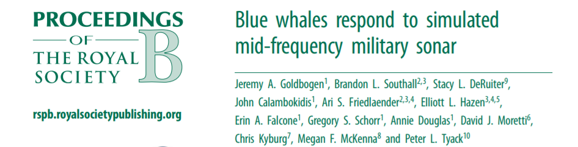
***
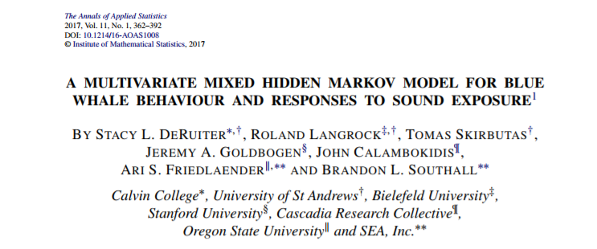
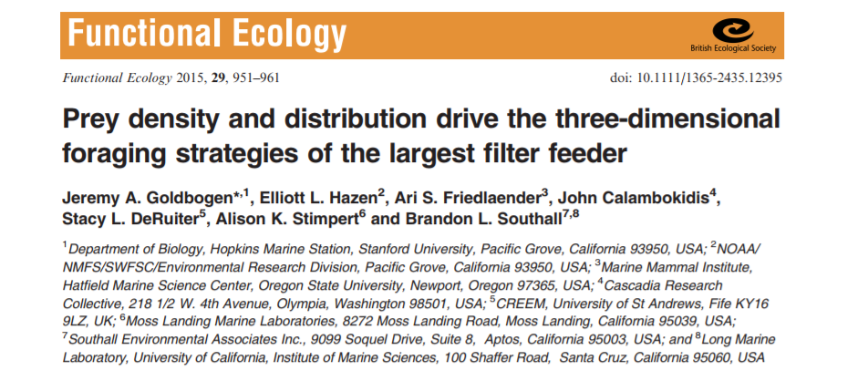


Detecting Lunges from Jerk
========================================================


Determine Necessary Inputs for detect_peaks
========================================================

```detect_peaks(data, sr, FUN, thresh, bktime, plot_peaks, varargin)```

```detect_peaks(data, sr, FUN = NULL, thresh, bktime, plot_peaks = TRUE, ...)```
- data = acceleration matrix in whale frame (Aw)
- sr = sampling rate of acceleration matrix
- FUN = njerk
- thresh = default
- bktime = ?


Blanking Time for Detecting Lunges
========================================================


- "durations between consecutive lunges, the time between speed maxima, averaged 44.5±19.1 s" (Goldbogen et al. 2006)
- bktime = 30


Tag On vs. Tag Off
========================================================

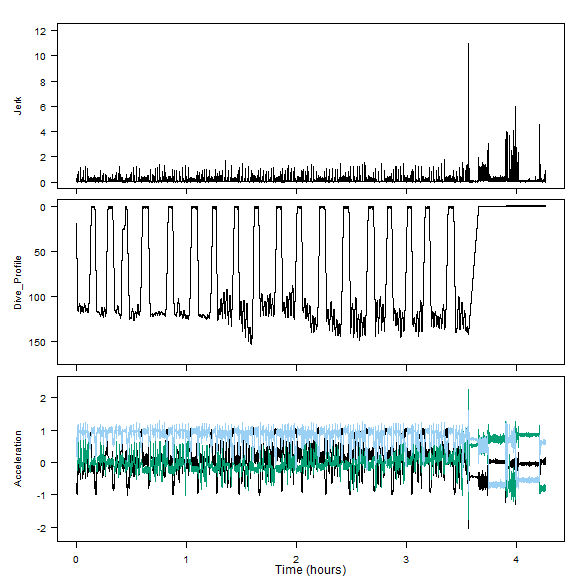

- Tag falls off the animal at about 3.5 hours since tag attachment


Crop Data
========================================================

```cropped_Aw <- crop(Aw, sampling_rate)```


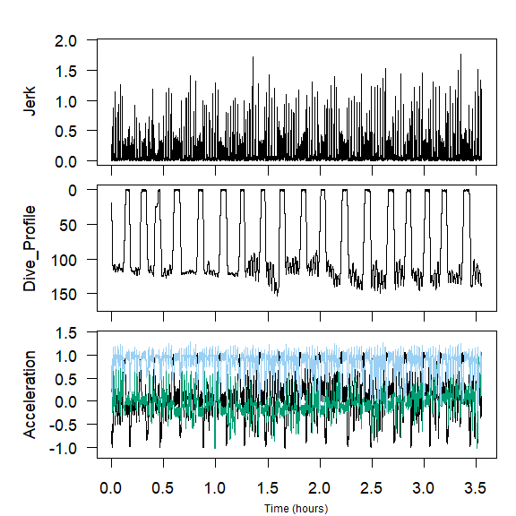


Running detect_peaks
========================================================

```detections <- detect_peaks(data = cropped_Aw, sr = sampling_rate, FUN = njerk, thresh = NULL, bktime = 30, plot_peaks = TRUE, sampling_rate = sampling_rate)```


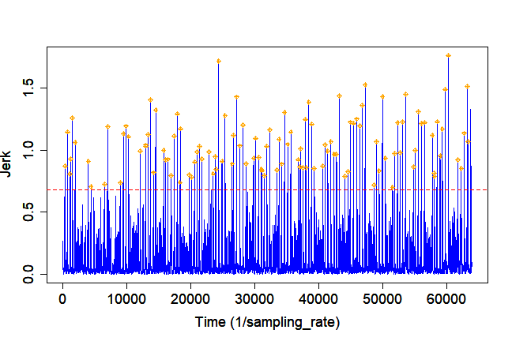


Using the Interactive Plot
========================================================

```"GRAPH HELP: For changing only the thresh level, click once within the plot and then click finish or push escape or push escape to specify the y-value at which your new thresh level will be. For changing just the bktime value, click twice within the plot and then click finish or push escape to specify the length for which your bktime will be. To change both the bktime and the thresh, click three times within the plot: the first click will change the thresh level, the second and third clicks will change the bktime. To return your results without changing the thresh and bktime from their default values, simply click finish or push escape."```


Using the Interactive Plot
========================================================

- Click the following coordinates [x , y]:
    - [30000 , 0.75]
- Click Finish

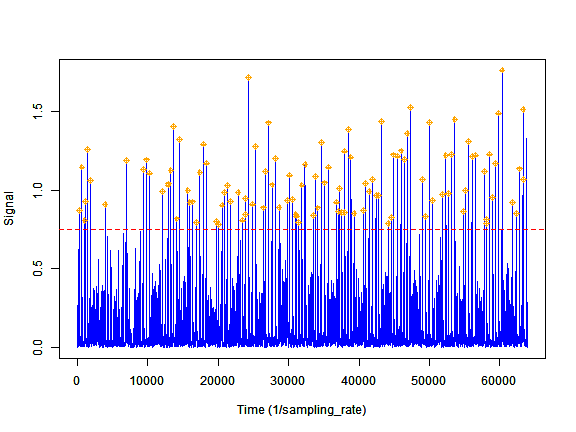


Comparing to Known Lunges
========================================================

- red dots = known lunging events
- gold crosses = detected lunging events

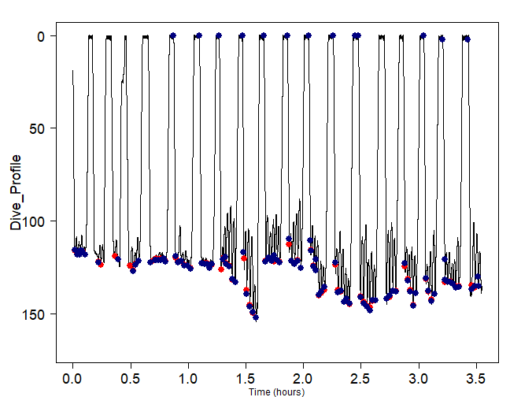


ROC Curve
========================================================

- Determine the false positive rate and the true positive rate of detections
    - false positive rate = (number false positive detections / number total possible events)
        - number of total possible events = ((recording time / sampling_rate) / blanking time)
    - true positive rate = (number true positive detections / number known events)


Generating ROC Curve
========================================================

Optimal threshold?

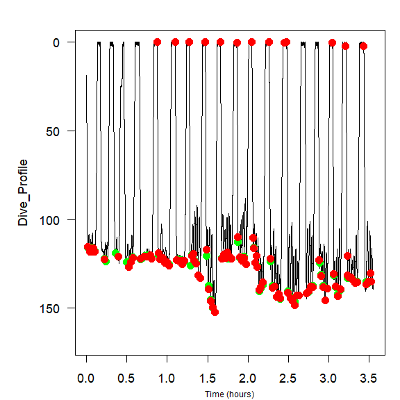


Rerun detect_peaks
========================================================

```detections <- detect_peaks(data = cropped_Aw, sr = sampling_rate, FUN = njerk, thresh = 0.95, bktime = 30, plot_peaks = FALSE, sampling_rate = sampling_rate)```

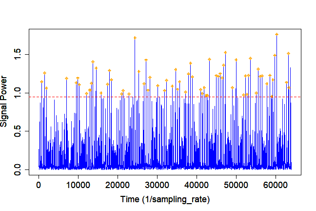


Overall Performance of detect_peaks
========================================================

- gray = default threshold and behavior-specific blanking time
- orange = optimal threshold and behavior-specific blanking time
- blue = maximum true positive threshold (.65) and behavior-specific blanking time

***
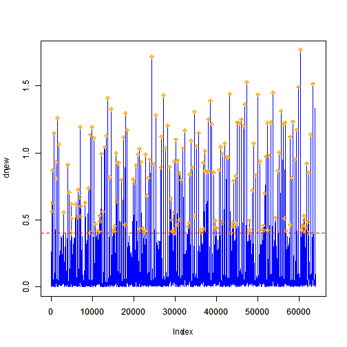


Default Threshold and Default Blanking Time
========================================================

```detections <- detect_peaks(data = cropped_Aw, sr = sampling_rate, FUN = njerk, thresh = NULL, bktime = NULL, plot_peaks = FALSE, sampling_rate = sampling_rate)```

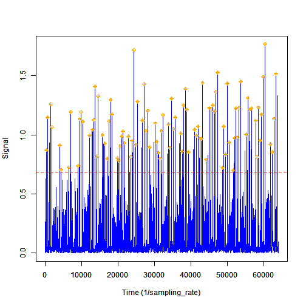


Comparing to Known Lunges
========================================================

- red points = known lunging events
- cyan crosses = detected lunging events from all default parameters

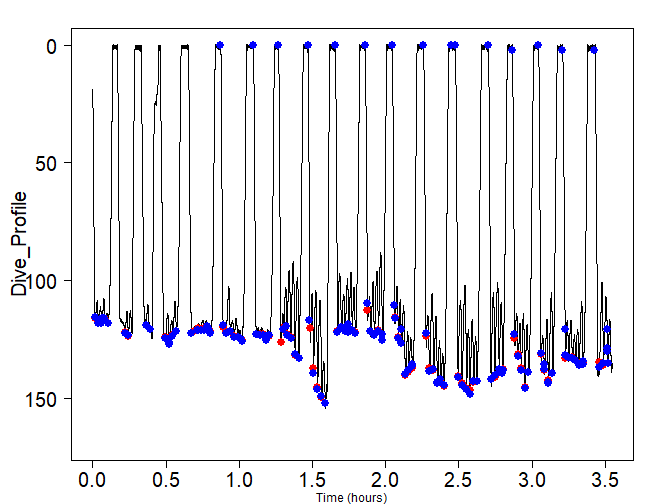


Overall Performance of detect_peaks
========================================================

- cyan = default threshold and default blanking time
- gray = default threshold and behavior-specific blanking time
- orange = optimal threshold and behavior-specific blanking time
- blue = maximum true positive threshold (.65) and behavior-specific blanking time

***
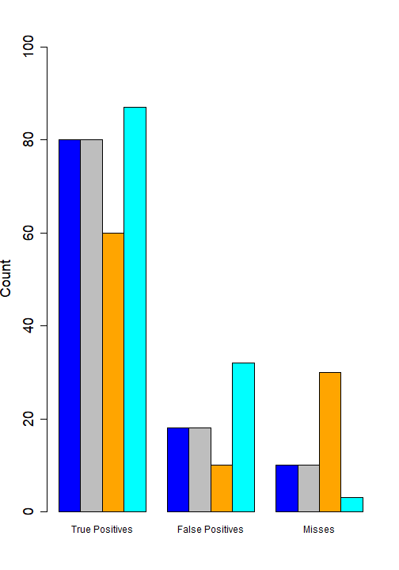
