Introduction
========================================================
author: Stacy DeRuiter 
date: 7 August 2017
autosize: true
incremental: true

Why tag?
========================================================
- What questions are best answered using tags? 
- What questions are *you* using tags to answer?

Why tag? A Running Example
========================================================

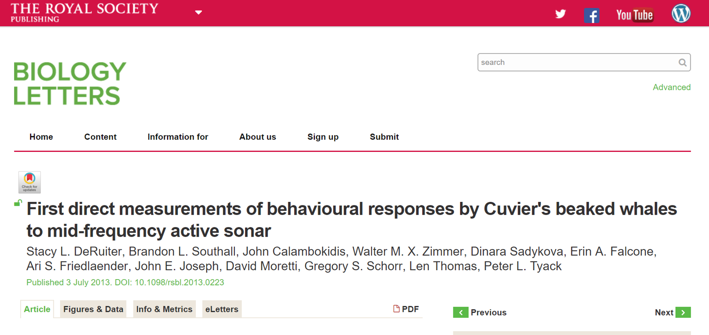


Why tag? A Running Example
========================================================
- Study species: *Ziphius cavirostris*
- Tag: DTAG3


Why tag? A Running Example
========================================================
Controlled Exposure Experiments (CEEs)

with Mid-frequency Active Sonar (MFAS)
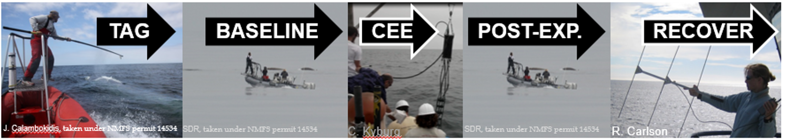

Ethics of tagging 
========================================================
- Can the question be answered with existing data?
- Are simulations a viable alternative?
- Is the tag suitable? 
    - sensors, sampling rates
    - accuracy
    - size 
    - tagging duration
    
Ethics in our example
========================================================
- Lack of existing data for analysis or simulation
- Was tag suitable?
    - What sound did whales receive?
    - Do dive behavior, body movement or foraging behavior indicate response?

DTAG3 chosen for SOCAL CEEs
========================================================
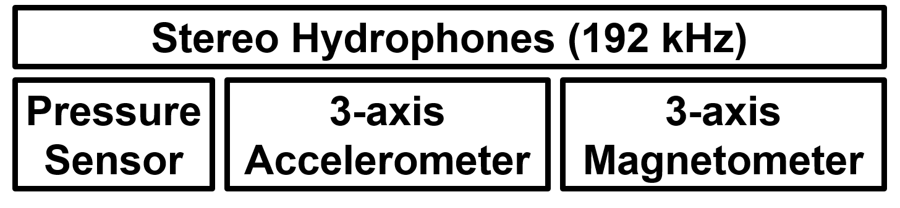

DTAG3 chosen for SOCAL CEEs
========================================================
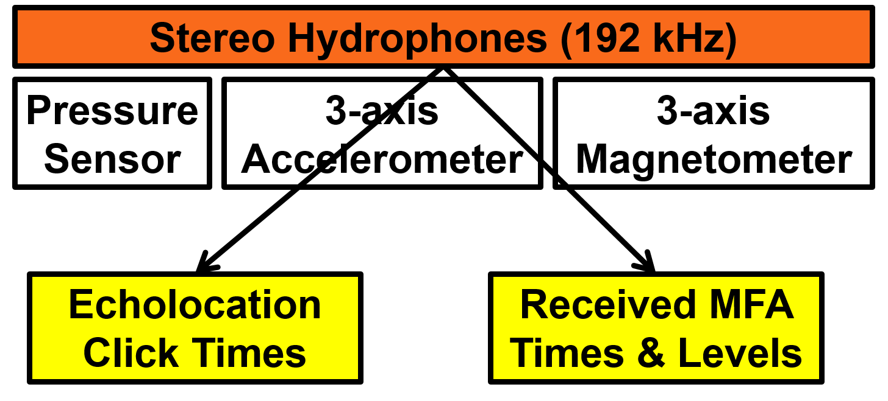

DTAG3 chosen for SOCAL CEEs
========================================================
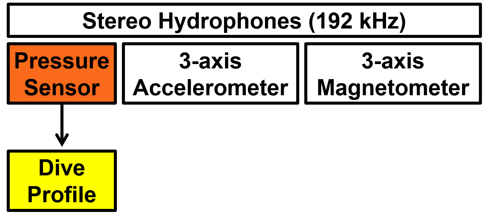

DTAG3 chosen for SOCAL CEEs
========================================================
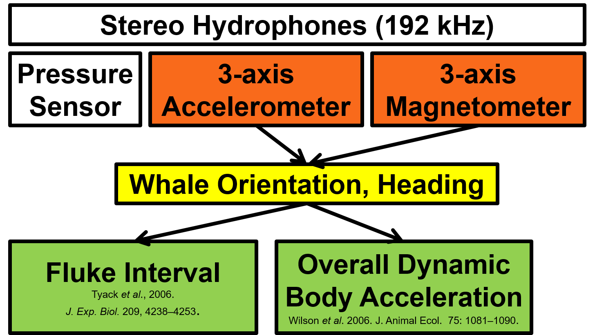

<!-- Ethics of tagging 2 -->
<!-- ======================================================== -->
<!--  - Do you need and have a permit? -->
<!--      - NOAA permits to approach, photograph and tag in SOCAL -->
<!--  - Do you have IACUC and peer approval? -->
<!--      - IACUC proposals and many public presentations, consults -->

<!-- Ethics of tagging 3 -->
<!-- ======================================================== -->
<!--  - How will you minimize risk to animals and personnel? -->
<!--      - Field protocols, sound source shut-down, data recovery -->
<!-- <div align='center'> -->
<!--  -->
<!-- <font size=4>  -->
<!-- <br>(photo from https://www.national-park.com/welcome-to-channel-islands-national-park/) -->
<!-- </font>  -->
<!-- </div> -->

<!-- Ethics of tagging 4 -->
<!-- ======================================================== -->
<!-- - How many animals will you need to tag to answer the question? (TWO?) -->
<!-- - How will you measure responses to tagging (during or after field work)? -->
<!-- - Can you collect and integrate all of the ancillary data needed? -->

Ancillary data
========================================================
- Visual observations 
- Acoustic tracking
- Visual and radar tracking of vessels in the area
- Photos and video
- Genetics (biopsy, skin sample)
- Life history of tagged whale (photo-id studies)
- Oceanographic measurements (CTD, current, bathymetry)

 Ancillary data challenges
========================================================
- Storage, quality control, archiving (paper? the dreaded spreadsheets?) 
- Accounting for effort
- Collaboration with others in the study area, data sharing
- **Integrating data with different time scales, varying accuracy**

Data-Sharing
========================================================
- How will you analyse the data to address your question? 
- Who else can use the data? 
- When and how will you share the data?
- What is "raw" data and is it what you should share?
<!-- - Does the value of the science merit the abuse? -->
<!-- <div align='center'> -->
<!-- 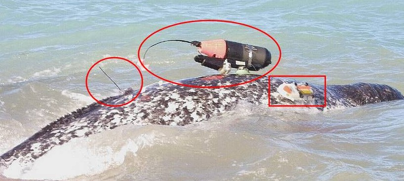 -->
<!-- <font size=4>  -->
<!-- <br>(photo from [Dietz et al. 2007, doi.org/10.1186/1472-6785-7-14](https://doi.org/10.1186/1472-6785-7-14)) -->
<!-- </font>  -->
<!-- </div> -->
<!-- Note: maybe move this to the very end (earn your coffee examples) and include here the "running example" -- cost (in many senses) per data point? -->

Types of tags
========================================================
- Short-term (day) to Long-term (year) 
- Attachment: suction cups, bolts, straps, glue...
- Sensors: Geo position, orientation, depth/altitude, sound, video, heart-rate, temperature...
- Archival vs. Telemetry

Trade-offs, Advantages & Disadvantages
========================================================
- Availability of tags & analysis tools
- "Ease" of attachment (for you and animal)
- Record duration vs. data density
- "Ease" of data retrieval

How do you choose a tag type?
========================================================
- What question are you trying to answer? 
- Is your tag appropriate? 
- **We've chosen... and you (may have chosen)...**

High resolution movement tags - WHAT?
========================================================
- Typically include:
    - Sensors sampled multiple times per second
    - Accelerometers to measure body posture and sudden movements or changes in speed
    - Magnetometers to measure direction of travel
    - Pressure/altitude sensors to measure dive depth in aquatic/marine species or flight altitude in birds

Hi-Res movement tag examples
========================================================
left: 65%
- [Greeneridge Acousonde movement/acoustic tags](http://www.acousonde.com/)
- [CATS movement and camera/movement tags](http://www.cats.is/)
- [DTAG movement/acoustic tags](http://soundtags.st-andrews.ac.uk/people/mark-johnson/)
- [Little Leonardo tags](http://l-leo.com/eng/data-logger)
- [Loggerhead Instruments Opentags](http://loggerhead.com/collections/all/products/opentag-datalogger)
- [Wildlife Computers Daily Diary tags](http://wildlifecomputers.com/products/daily_diary)

***

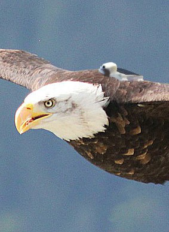
<div align=center>
<font size=3>
(Image from http://www.cats.is) 
</font>
</div>

High resolution movement tags - WHY?
========================================================
- Challenges
    - "Big" datasets
    - Varying sensor sampling rate, accuracy, synchronization
    - Interdisciplinary: Engineering, Biology, Physics, Math/Stat...

High resolution movement tags - WHY?
========================================================
- Motivation for tool kit and workshop
    - Make tools freely and widely accessible
    - Provide better documentation
    - Build connections across tagging community
    - Work toward standardization across tag types, species, ...
    - Provide on-ramp for new users and idea sharing for experts
    
Wait, no point-and-click automation?
========================================================
- Tag data are full of surprises!
- Creativity is essential to make the most of your data
- Goal is empowering researchers to explore, not automation of all data processing

Data analysis can be dangerous!
========================================================
left: 19%
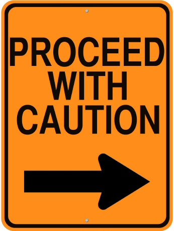
***
Understanding **what sensors really measure** and **how to analyze them** are key.

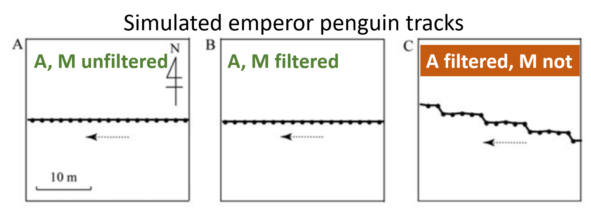
<font size=5>
(Figure from Shiomi et al. 2010, doi: 10.3354/ab00239)
</font>

Working with tag data
========================================================
*How do we get from A...*
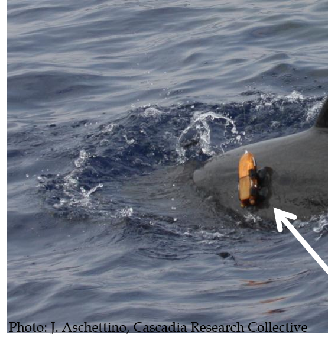
***
*... to B?*
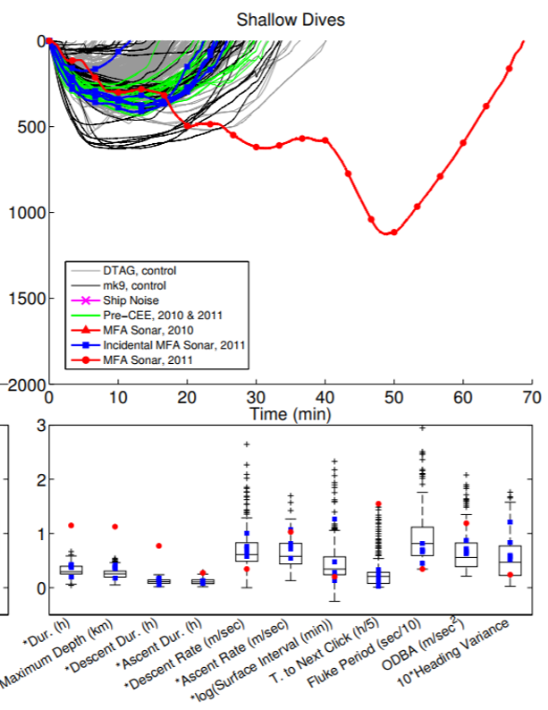

Choose software
========================================================
- Matlab
    - Pros: Broad user base, flexible, *fast* at matrix calculations
    - Cons: Expensive, steep learning curve
- Octave
    - Pros: Free & open source, "almost matlab" now
    - Cons: Basic user interface, steep learning curve
- R/RStudio
    - Pros: Free & open source, pro stats standard, tutorials/resources
    - Cons: Slower (?), steep learning curve

Where's the gradual learning curve?
========================================================

Check out some online learning resources gathered at:

[https://github.com/stacyderuiter/TagTools/wiki/Software](https://github.com/stacyderuiter/TagTools/wiki/Software)

Tag tools help & documentation
========================================================
Learn and contribute at

[http://www.animaltags.org](http://www.animaltags.org)
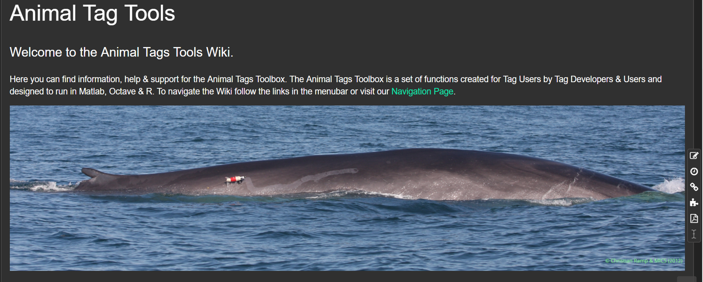

**It's a wiki - join us!**

A key difference between Matlab/Octave and R
========================================================
- In Matlab/Octave, input arguments to functions are not named
- User must enter arguments in a set order, and software interprets accordingly depending on how many inputs there were
- If you want to leave out one input and specify a later one, you may have to enter "[]" for the earlier input

A key difference between Matlab/Octave and R
========================================================
- In R, the user *can* enter un-named input arguments; if so they must be in the "expected" order (just like in Matlab/Octave)
- In R, the safe/flexible option is to name inputs to a function. If inputs are named, the order they are specified in doesn't matter.
  - Imagine you want to plot **p** as a function of **t**. You could use:
      - plot(t,p)
      - plot(x=t, y=p)
      - plot(y=p, x=t)
      
 Consequences for tag tools
========================================================
- Some Matlab/Octave tag tools use specific input arguments differently depending on how many inputs are provided (and what kind of objects they are).
- Example: plott.m (Matlab/Octave) can have from one to many inputs. The second one is interpreted as:
    - a sampling rate (fsx), 
    - an indicator for whether to reverse the y-axis scale (r), or
    - a second sensor data input
    - ...depending on how many total inputs there are.

 Consequences for tag tools
========================================================
- plott.R has 11 different named inputs
    - only one of the 11 is absolutely required
    - user decides which inputs to supply and uses names
    - ex.: plott(X, r=TRUE, interactive=TRUE)
      
Read in data
========================================================
- Tag tools can read in:
    - Raw data from several tag types 
    - archival format netCDF files (<-- our focus)
- NetCDF files (.nc) must be stored locally before reading.
- Assume we have a file stored at C:\data\testset1.nc
- R:    

```r
testset1 <- load_nc('C:\data\testset1.nc')
```

- Matlab/Octave:

```r
testset1 = load_nc('C:\data\testset1.nc') ;
```

Tag data work flow
========================================================
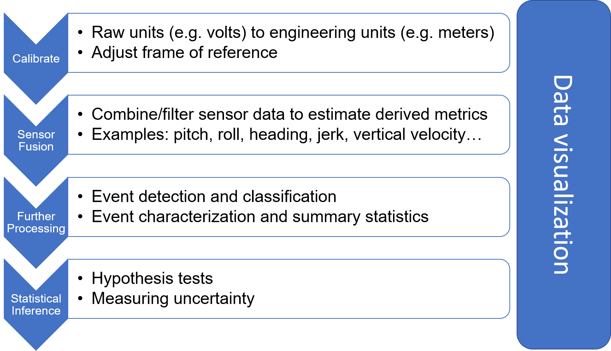
- Stay tuned for details in upcoming lectures!

Attach metadata
========================================================
Metadata has at least 2 sources:
- Gleaned automatically from tag data files
- User-provided 

Tag metadata csv format (text file)
========================================================
- Animaltags.org has documentation of *what* tag metadata includes
- [http://animaltags.org/doku.php?id=tagwiki:tools:formats](http://animaltags.org/doku.php?id=tagwiki:tools:formats)

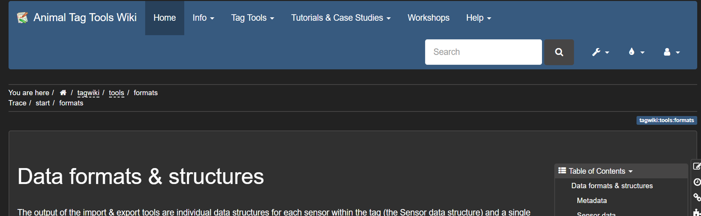

Saving tag metadata to csv
========================================================
- Some metadata is automatically gleaned and stored in a csv when you use the tag tools to load raw data
- An interface is provided to add user-generated metadata to this machine-generated file.
- If the machine-generated file is 'auto.csv', in R or matlab:


```r
metadata_editor('tagmetadata.html', 'auto.csv')
```

Saving tag metadata to csv (2)
========================================================
- Code from last slide will open a fillable form.
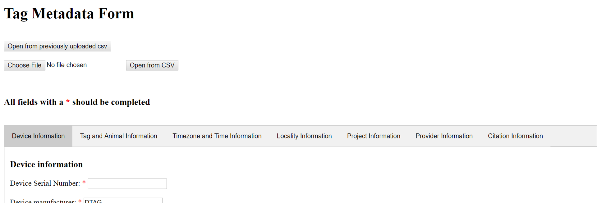
- Some fields are always auto-gleaned and don't appear on the form for users to fill in.
- If you use the form without a machine-generated csv input, these fields will all contain missing values in the resulting csv.

Archiving data + metadata to netCDF
========================================================
**There's currently no "standard" format for tag data;**

**Raw datasets from most tags are not archive-ready.**

Archiving data + metadata to netCDF
========================================================
**netCDF format...**
- Developed with NSF funds for geoscience community
- Is flexible, accomodates data and metadata fields
- Allows many user-defined fields
- Supported by well-defined standards and conventions
- May serve as a standad format for journals that require data publication
- *"supports a view of data as a collection of self-describing, portable objects that can be accessed through a simple interface"* (-[NetCDF website](http://www.unidata.ucar.edu/software/netcdf/docs/netcdf_introduction.html))

Exporting data + metadata to archives
========================================================
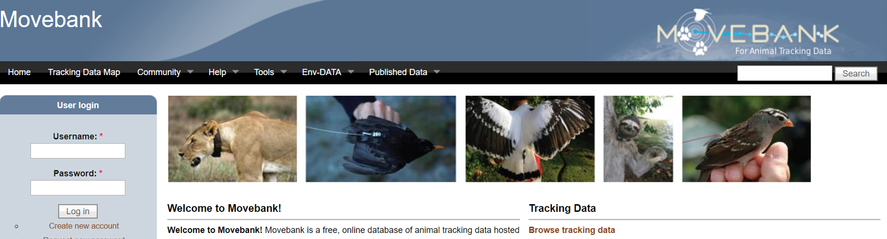

Exporting data + metadata to archives
========================================================

<br>[Animal Telemetry Network (ATN) Data Assembly Center (DAC)](https://ioos.noaa.gov/project/atn/#data)

Exporting data + metadata to archives
========================================================
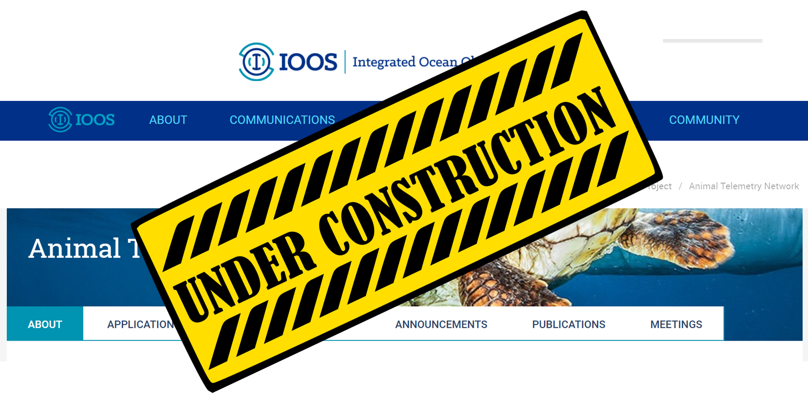
<br>[Animal Telemetry Network (ATN) Data Assembly Center (DAC)](https://ioos.noaa.gov/project/atn/#data)


Tag tool kit installation in R
========================================================
- In R, all "tools" must be bundled in **packages**.
- To use a package, you must:
    - **Install** the package (one-time-only)
    - **Load** the package (every new R session)
    
Tag tool kit installation in R
========================================================    
Option A) Install "development version" from GitHub

```r
#install.packages('devtools')
devtools::install_github(
  'stacyderuiter/TagTools/R/tagtools')
```

Tag tool kit installation in R
======================================================== 
Option B) Install from your memory stick. In RStudio:
- Select the **Packages** tab in the lower right pane
- Click **Install**
- Choose **Install from package archive file**
- Click **Browse** and navigate to the R tagtools zip file on your memory stick
- Click **Install**!

(Live Demo)
======================================================== 
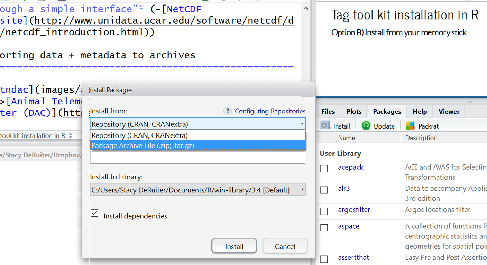

Tag tool kit installation in Matlab
========================================================
- Matlab has access to all functions that are:
    - In directories that are on the **Matlab Path**
    - In the user's **current directory** ("Current Folder" in GUI)

Tag tool kit installation in Matlab
========================================================
- Unpack the Matlab tagtools zip file on your computer
- In Matlab, in the **Home** tab, click **Set Path**
- Click **Add with Subfolders** and then select the tagtools directory
- Click **Save** to save the modified path

(Live Demo)
======================================================== 


Tag tool kit installation in Octave
========================================================
- Octave has access to all functions that are:
    - In the user's current directory ("File Browser" in GUI)
    - In **packages** that have been
        - **installed** (one-time operation) and
        - **loaded** (every new Octave session)
        
Tag tool kit installation in Octave
========================================================
- Save the matlab/octave tagtools directory to a convenient location on your computer
- Add that tagtools directory to Octave's path (change the path to match your computer):

```r
path_tagtools = genpath('C:\tagtools\')
addpath(path_tagtools)
savepath
```

<!-- To install the tag tools package (assuming the Matlab/Octave zip file is stored in F:\\tagtools\\matlab), run: -->

<!-- ```{r, echo=TRUE, eval=FALSE} -->
<!-- pkg install tagtools0.0.0.tar.gz -->
<!-- ``` -->

<!-- Then to load it: -->

<!-- ```{r, echo=TRUE, eval=FALSE} -->
<!-- pkg load tagtools -->
<!-- ``` -->

Octave dependencies
========================================================
In Octave, you also need to manually [install and load](https://www.gnu.org/software/octave/doc/interpreter/Installing-and-Removing-Packages.html) the packages:

- control
- netcdf
- signal
- io (for reading DTAG files)
- and possibly: statistics, mapping, ncarray, lssa,ltfat, database. 

If you are online, you can simply run (for example):

```r
pkg install netcdf 
pkg load netcdf
```

Octave tips and tricks
========================================================
- You can customize Octave's start-up routine (autoload packages).
- See [http://www.animaltags.org/doku.php?id=tagwiki:help:octave:autoload](http://www.animaltags.org/doku.php?id=tagwiki:help:octave:autoload) for details.


And when it all goes wrong?
========================================================
For specific tools, help is only a command away. Example: need help with the function **plott()**?

in Matlab/Octave:

```r
help plott
```

in R:

```r
?plott
```

Project directory structure - Best practices
========================================================
- As possible, save data, code, and documents in subdirectories of one main project directory
- Document your work:
    - Save files rather than just running code in the console
    - Document your code with comments and explantions
    - Give variables names that are easy to understand
    - Prefer descriptive labels to numeric identifiers
- Consider **Reproducible Research** - code, documentation and report all in one document!
    - In R: [knitr](https://yihui.name/knitr/)
    - In R: [Rmarkdown](http://rmarkdown.rstudio.com/)
    - In Octave/Matlab... ?


Begin analysis? 
========================================================
(Stay tuned...Maybe after a coffee.)

Exercises to earn your coffee
========================================================
(just a few!)

What is wrong (or right) here?
========================================================
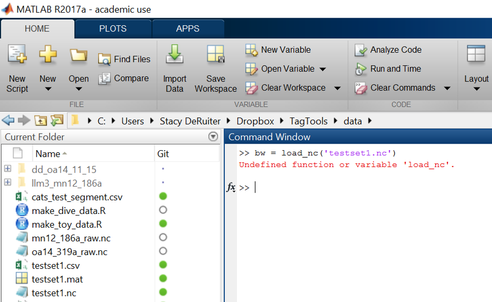

What is wrong (or right) here?
========================================================


What is wrong (or right) here?
========================================================
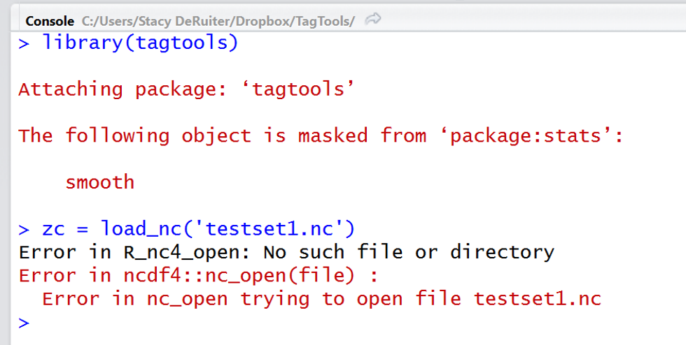


What is wrong (or right) here?
========================================================
- Can you argue both ways?
<div align='center'>

<font size=4>
<br>(photo from [Dietz et al. 2007, doi.org/10.1186/1472-6785-7-14](https://doi.org/10.1186/1472-6785-7-14))
</font>
</div>


