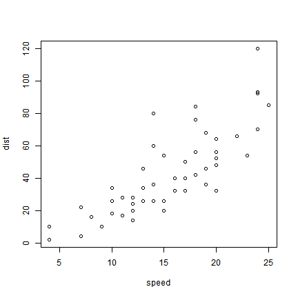

---
output:
  pdf_document: default
  html_document: default
---
workshop_slide_template
========================================================
author: Stacy DeRuiter
date: 10 July 2017
autosize: true

This is the title of the first slide.
========================================================

A title and then a line of "=" delineates the start of a new slide in the .Rpres text file.

You can also include bullet points. Careful: The blank line before the first bullet point, and the space after the "-", are obligatory.

- Bullet 1
- Bullet 2
- Bullet 3

Slide With R Code
========================================================

R code can be included in a slide like so. It will be executed when the presentation is compiled. By default, output generated by the code is also included in the slide. 


```r
summary(cars)
```

```
     speed           dist       
 Min.   : 4.0   Min.   :  2.00  
 1st Qu.:12.0   1st Qu.: 26.00  
 Median :15.0   Median : 36.00  
 Mean   :15.4   Mean   : 42.98  
 3rd Qu.:19.0   3rd Qu.: 56.00  
 Max.   :25.0   Max.   :120.00  
```

Slide With R code and no output
========================================================

To include code but not its output, use the R code chunk option "results='hide'".


```r
summary(cars)
```

Slide displaying unevaluated R (or matlab) code
========================================================

You can also display code without evaluating it by including the option eval=FALSE in the R code chunk. For example, the matlab code below wouldn't work in R, but we can display it anyway.

Learn more about R code chunk options online: <https://yihui.name/knitr/options>.


```r
my_matrix = eye(7);
```

Slide With Plot
========================================================

You can also include a graphic generated in R on-the-fly, without showing the code used to generate the figure. Options are available to control the size of the output figure (default units are inches).


Slide With Bigger, Centered Plot
========================================================




Text Formatting
========================================================

We can have **bold** and *italicized* text (and any other formatting you can specify in RMarkdown: see <https://www.rstudio.com/wp-content/uploads/2016/03/rmarkdown-cheatsheet-2.0.pdf>).

Slide With Two Columns
========================================================
This stuff goes on the left:

Often we want to have two columns on a slide. 

***

This stuff goes on the right: 

We can! 

Slide With Image and Text
========================================================
left: 70%

This left column takes up 70% of the slide...

***
And the right column gets the rest.

Slide With Unequal-width Columns
========================================================
left: 70%


***
We can also include figures or images *not generated on the fly -- local files or online images both work. 

Equations
========================================================
 You can also include equations inline: $E = MC^2$ (be careful not to leave whitespace adjacent to the $)
 
 Or in display mode:
 
 $$ e^{i\phi} = \text{cos}(\phi) + i\text{sin}(\phi)$$

More Help
========================================================

For more help and examples, check out <https://support.rstudio.com/hc/en-us/articles/200486468-Authoring-R-Presentations>.
